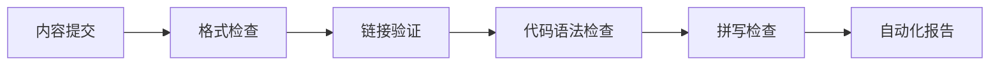
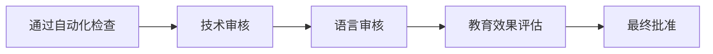
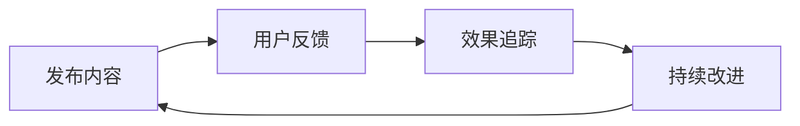

# [TASK002] - 建立内容质量保证流程

**状态：** 进行中  
**添加日期：** 2025年8月6日  
**更新日期：** 2025年8月6日

## 原始需求
建立完善的内容质量保证流程，确保项目中的所有教育内容都达到高质量标准。包括代码示例的正确性、中文表达的专业性、技术内容的准确性和时效性。建立可扩展的审核机制，为未来的社区贡献做准备。

## 思考过程
质量保证是项目成功的关键，需要考虑：

1. **多层次验证**：自动化检查 + 人工审核 + 社区验证
2. **标准化流程**：建立清晰的质量标准和检查流程
3. **可扩展性**：随着内容增长和贡献者增加的可扩展性
4. **持续改进**：基于反馈不断优化质量标准
5. **效率平衡**：在质量和效率之间找到最佳平衡

通过分析项目的特点和目标，设计了三层质量保证机制。

## 实施计划
1. 制定质量标准和检查清单
2. 建立自动化检查工具
3. 设计人工审核流程
4. 创建贡献者指南
5. 建立反馈收集机制
6. 测试和优化流程
7. 培训审核人员

## 进度跟踪

**整体状态：** 进行中 - 30%

### 子任务
| ID | 描述 | 状态 | 更新日期 | 备注 |
|----|------|------|----------|-------|
| 2.1 | 质量标准制定 | 进行中 | 2025-08-06 | 已确定基本框架 |
| 2.2 | 自动化检查工具 | 未开始 | - | 计划使用现有工具 |
| 2.3 | 人工审核流程 | 进行中 | 2025-08-06 | 设计审核角色和职责 |
| 2.4 | 贡献者指南 | 未开始 | - | 等待流程确定 |
| 2.5 | 反馈机制设计 | 未开始 | - | 计划多渠道收集 |
| 2.6 | 流程测试优化 | 未开始 | - | 在实际内容上测试 |
| 2.7 | 审核人员培训 | 未开始 | - | 等待审核人员招募 |

## 进度日志

### 2025年8月6日
- 开始制定质量标准框架
- 分析了项目的质量需求和挑战
- 设计了三层质量保证机制的基本结构
- 确定了关键的质量指标和检查点
- 开始规划人工审核的角色和职责

## 质量标准框架

### 1. 内容质量标准

#### 技术准确性
- [ ] 代码示例必须可运行
- [ ] 技术概念表述准确
- [ ] 版本兼容性明确
- [ ] 安全实践正确

#### 语言质量
- [ ] 中文表达自然流畅
- [ ] 技术术语使用一致
- [ ] 语法和拼写正确
- [ ] 结构清晰易懂

#### 教育有效性
- [ ] 学习目标明确
- [ ] 难度循序渐进
- [ ] 实践性强
- [ ] 反馈机制完善

#### 格式规范
- [ ] Markdown 格式正确
- [ ] 代码高亮适当
- [ ] 图片和链接有效
- [ ] 目录结构清晰

### 2. 检查流程设计

#### 第一层：自动化检查

#### 第二层：人工审核

#### 第三层：社区验证

## 工具和技术方案

### 自动化检查工具
1. **Markdown 检查**
   - markdownlint：格式和风格检查
   - 自定义规则：项目特定要求

2. **代码验证**
   - 各语言的 linter 工具
   - 语法检查和最佳实践验证

3. **链接和资源**
   - markdown-link-check：链接有效性
   - 图片和资源文件检查

4. **中文处理**
   - 中文拼写检查工具
   - 术语一致性检查

### 人工审核工具
1. **审核清单**
   - 标准化的检查项目
   - 评分和评估标准

2. **协作平台**
   - GitHub PR 审核机制
   - 评论和建议系统

3. **知识库**
   - 常见问题和解决方案
   - 最佳实践案例

## 角色和职责

### 审核角色定义
1. **技术审核员**
   - 验证代码正确性
   - 检查技术概念准确性
   - 评估最佳实践遵循

2. **语言审核员**
   - 检查中文表达质量
   - 确保术语使用一致
   - 优化阅读体验

3. **教育专家**
   - 评估教学效果
   - 检查学习路径设计
   - 建议改进方案

4. **社区管理员**
   - 收集用户反馈
   - 协调审核流程
   - 维护社区标准

### 审核流程
1. **初步检查**：自动化工具检查
2. **技术审核**：专业技术人员审核
3. **语言优化**：语言专家优化
4. **教育评估**：教育效果评估
5. **最终确认**：多人确认发布

## 质量指标

### 定量指标
- 代码示例可运行率：>95%
- 链接有效性：>98%
- 语法错误率：<1%
- 审核通过率：>80%

### 定性指标
- 用户满意度：>85%
- 技术准确性评分：>4.5/5
- 语言质量评分：>4.5/5
- 教育效果评分：>4.0/5

## 风险和挑战

### 主要风险
1. **审核瓶颈**
   - 风险：人工审核可能成为瓶颈
   - 缓解：建立分级审核，优先级管理

2. **标准一致性**
   - 风险：不同审核员标准不一致
   - 缓解：详细的审核指南和培训

3. **效率vs质量**
   - 风险：过度追求质量影响效率
   - 缓解：分级要求，核心内容高标准

### 缓解策略
- 建立清晰的优先级体系
- 提供充分的审核培训
- 定期评估和优化流程
- 建立审核员反馈机制

## 成功指标

- [ ] 建立完整的质量标准文档
- [ ] 实现自动化检查工具集成
- [ ] 培训至少3名合格审核员
- [ ] 质量指标达到预设目标
- [ ] 建立可持续的改进机制

## 相关任务

- **并行任务**：[TASK001] 完善提示词模板体系
- **后续任务**：[TASK005] 制定社区贡献指南
- **依赖任务**：需要 TASK001 的内容进行流程测试
