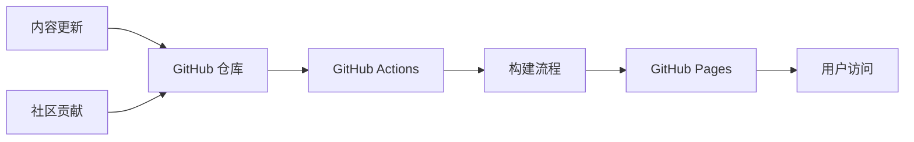

# 技术上下文

## 技术栈概述

### 主要技术
- **文档格式**：Markdown（.md）
- **版本控制**：Git + GitHub
- **协作平台**：GitHub（Issues, Discussions, Pull Requests）
- **自动化**：GitHub Actions（CI/CD）
- **静态站点**：支持 GitHub Pages 部署
- **AI 工具集成**：GitHub Copilot, MCP (Model Context Protocol)
- **扩展生态**：VS Code Extensions, JetBrains Plugins

### 支持的编程语言
**优先级排序（基于中国开发者社区使用情况）**：
1. **JavaScript/TypeScript** - 前端开发主流
2. **Python** - AI/ML 和后端开发热门
3. **Java** - 企业级应用主流
4. **Go** - 云原生和微服务流行
5. **C#** - .NET 生态系统
6. **PHP** - Web 开发传统强势
7. **Rust** - 系统编程新星
8. **Swift/Kotlin** - 移动开发

### 框架和技术栈重点
**前端技术**：
- Vue.js 3 (中国开发者偏好)
- React (全球主流)
- 微信小程序
- uni-app
- Vite 构建工具

**后端技术**：
- Spring Boot (Java)
- FastAPI/Django (Python)
- Express.js/Nest.js (Node.js)
- Gin (Go)

**数据库技术**：
- MySQL/PostgreSQL
- MongoDB
- Redis

**云服务（中国特色）**：
- 腾讯云
- 阿里云
- 华为云

## 开发环境

### 推荐 IDE 配置
**VS Code（主要）**：
- GitHub Copilot 扩展
- GitHub Copilot Chat 扩展
- Chinese (Simplified) Language Pack
- 推荐的扩展包配置

**其他支持的 IDE**：
- JetBrains IDEs (IntelliJ IDEA, PyCharm, WebStorm)
- Eclipse (Java 开发)
- Xcode (iOS 开发)

### 环境要求
- **Node.js**：v16+ (用于前端工具链)
- **Python**：3.8+ (用于 AI/ML 示例)
- **Git**：最新稳定版
- **GitHub Copilot 订阅**：个人版或企业版

## 依赖管理

### 依赖工具更新
- **文档依赖**：
  - Markdown 解析器：支持 GitHub Flavored Markdown
  - 代码高亮：Prism.js 或类似工具
  - 图表渲染：Mermaid.js 支持
  - 数学公式：KaTeX 支持（如需要）

- **验证工具**：
  - Markdown 检查：markdownlint
  - 链接验证：markdown-link-check
  - 代码检查：各语言的 linter 工具
  - 拼写检查：中英文拼写检查工具

- **AI 相关工具**：
  - GitHub CLI：gh copilot 扩展
  - MCP 工具：文件系统、数据库、Git 等工具
  - VS Code 扩展：Copilot、Copilot Chat、Copilot Labs
  - 质量检查：AI 代码建议的人工审核机制

## 技术约束

### GitHub Copilot 版本兼容性
- **目标版本**：2024-2025年发布的功能
- **支持版本**：Free, Business, Enterprise（重点关注）
- **EMU 兼容**：Enterprise Managed Users 特殊场景支持
- **新功能采用**：谨慎采用预览版功能，优先稳定版
- **版本追踪**：定期更新以反映最新功能变化

### MCP (Model Context Protocol) 集成
- **协议版本**：支持最新稳定版 MCP 协议
- **工具兼容**：确保推荐的 MCP 工具可用性
- **集成测试**：验证 MCP 工具与 Copilot 的集成效果
- **文档同步**：跟踪 MCP 生态系统的发展

### 扩展生态兼容性
- **VS Code 扩展**：确保推荐扩展的当前可用性
- **JetBrains 插件**：支持主流 IDE 的插件生态
- **版本依赖**：明确扩展的最低版本要求
- **兼容性测试**：定期验证扩展组合的稳定性

### 浏览器兼容性
- **现代浏览器**：Chrome 90+, Firefox 88+, Safari 14+, Edge 90+
- **移动端**：iOS Safari, Android Chrome
- **中国特色**：确保在国内网络环境下的访问性能

### 性能约束
- **页面加载**：首屏 < 3秒
- **图片优化**：WebP 格式优先，压缩优化
- **代码示例**：避免过大的代码块，提供折叠功能
- **移动友好**：响应式设计，移动端优化

## 安全考虑

### 代码安全
- **敏感信息**：禁止在示例中包含真实密钥、密码
- **最佳实践**：展示安全编码模式
- **漏洞预防**：避免展示有安全问题的代码

### 内容安全
- **版权合规**：确保所有内容原创或正确引用
- **许可证明确**：明确内容使用许可
- **隐私保护**：不收集用户个人信息

### 访问控制
- **开放访问**：公开仓库，欢迎社区贡献
- **贡献管控**：Pull Request 审核机制
- **质量把关**：维护者审核制度

## 部署架构

### 静态部署

### 构建流程
1. **内容验证**：Markdown 格式检查
2. **链接检查**：确保所有链接有效
3. **代码测试**：验证代码示例可运行
4. **静态生成**：生成静态网站
5. **部署发布**：自动部署到 GitHub Pages

### 监控和维护
- **访问分析**：GitHub Pages 访问统计
- **错误监控**：404 错误和链接失效检查
- **性能监控**：页面加载速度监控
- **内容更新**：定期检查 Copilot 功能更新

## 本地化技术

### 中文支持
- **字体选择**：支持中文字体的网页字体栈
- **输入法支持**：确保中文输入的兼容性
- **搜索优化**：中文分词和搜索优化

### 国内网络优化
- **CDN 加速**：使用国内 CDN 服务
- **资源本地化**：避免依赖被墙的外部资源
- **备用方案**：提供国内镜像或替代方案

## 扩展性技术方案

### 内容管理系统扩展
- **模板引擎**：支持动态内容生成
- **多语言支持**：未来可能的英文版本
- **API 接口**：为第三方工具提供数据接口

### 社区功能扩展
- **评论系统**：Giscus 或类似方案
- **用户认证**：GitHub OAuth 集成
- **贡献统计**：贡献者排行和统计

### 分析和洞察
- **用户行为分析**：了解内容使用模式
- **效果评估**：学习效果跟踪
- **需求预测**：基于数据的内容规划

这种技术架构既保证了项目的技术先进性，又考虑了中国开发者社区的特殊需求和网络环境。
