# 🚀 GPT‑5 编码优势与在 GitHub Copilot 中的 premium request 说明

> **TL;DR** GPT-5 在 GitHub Copilot 中提供更强的代码能力和更长的上下文，但作为 premium 模型需要额外配额。本文档提供完整的使用指南和多媒体说明。

## 📋 目录导航
- [🎯 为什么选择 GPT‑5](#-为什么在编码场景选择-gpt5)
- [💰 Premium 请求计费说明](#-在-github-copilot-中属于-premium-request计费与配额)
- [⚙️ VS Code 配置使用](#️-在-vs-code-中启用并使用开启组织策略后重新登录即可)
- [📚 参考资源](#-参考链接)

## 🎯 为什么在编码场景选择 GPT‑5

### 📊 核心优势对比

| 特性 | GPT-5 | Claude 4 Sonnet | GPT-4o | GPT-4 Turbo |
|------|-------|------------------|--------|-------------|
| **上下文窗口** | ~400K tokens | 200K tokens | 128K tokens | 128K tokens |
| **最大输出** | ~128K tokens | ≤64K tokens | 4K tokens | 4K tokens |
| **SWE-bench Verified** | 74.9%* | 72.7%†（标准）/ 80.2%‡（高算力） | ~49% | ~43% |
| **Aider Polyglot** | 88%* | — | ~77% | ~71% |
| **推理模式** | ✅ 支持 | ✅ 支持 | ❌ 不支持 | ❌ 不支持 |

#### 🎯 性能对比可视化

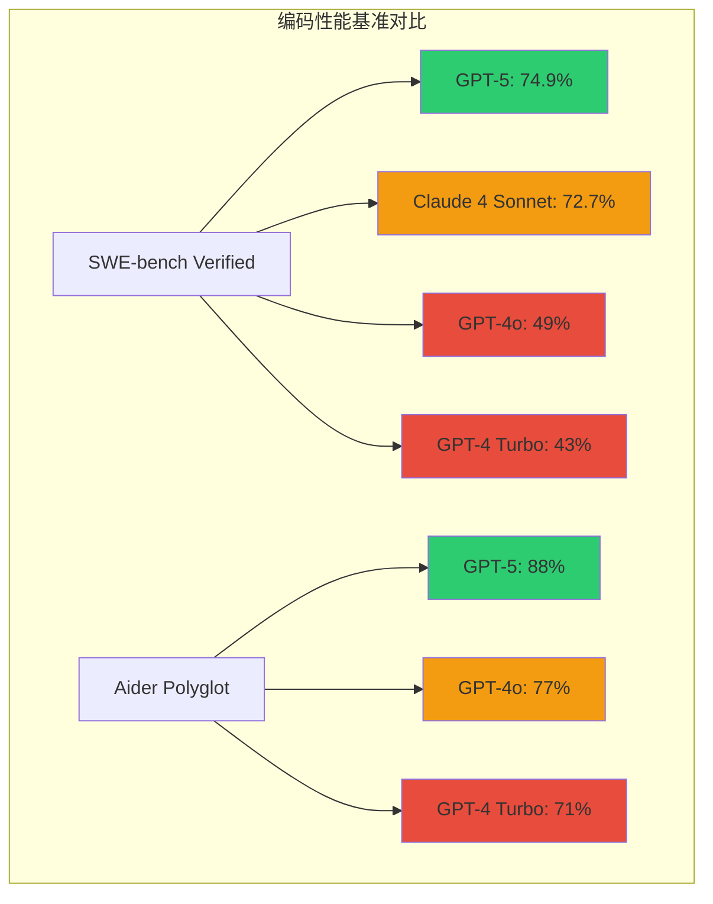

#### 🚀 核心优势流程图

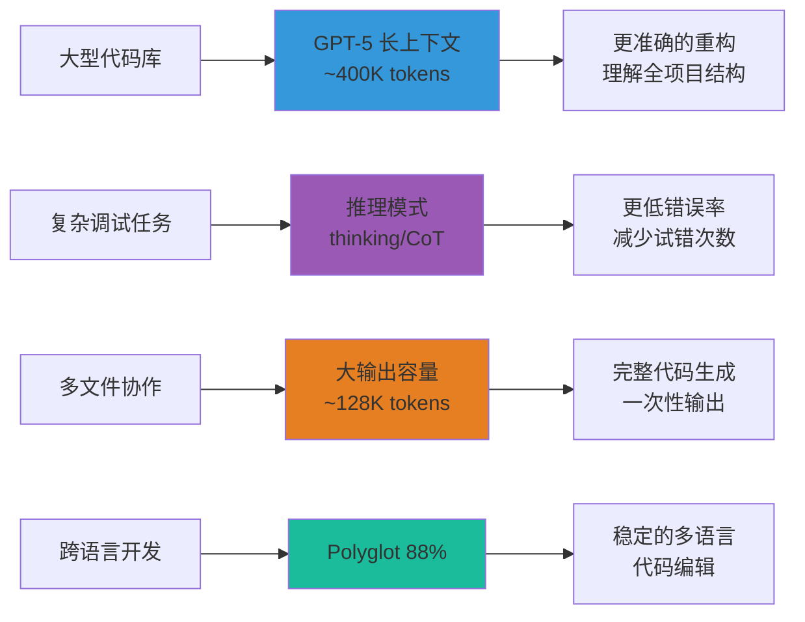

### 🔍 详细能力分析

#### 💾 **更长上下文与更大输出**

##### 📏 容量对比可视化
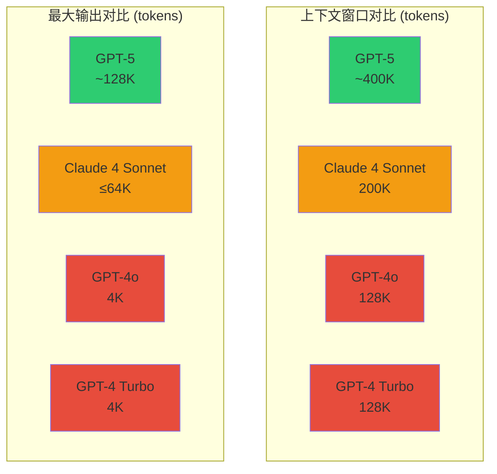

- **上下文窗口**：约 400K tokens，相当于约 30万字的代码文档
- **最大输出**：约 128K tokens，可一次性生成大型功能模块
- **适用场景**：
  - 🏗️ 大型代码库分析与重构
  - 📚 多文件协作开发
  - 🔧 长对话调试与问题定位

##### 🎯 实际应用场景展示
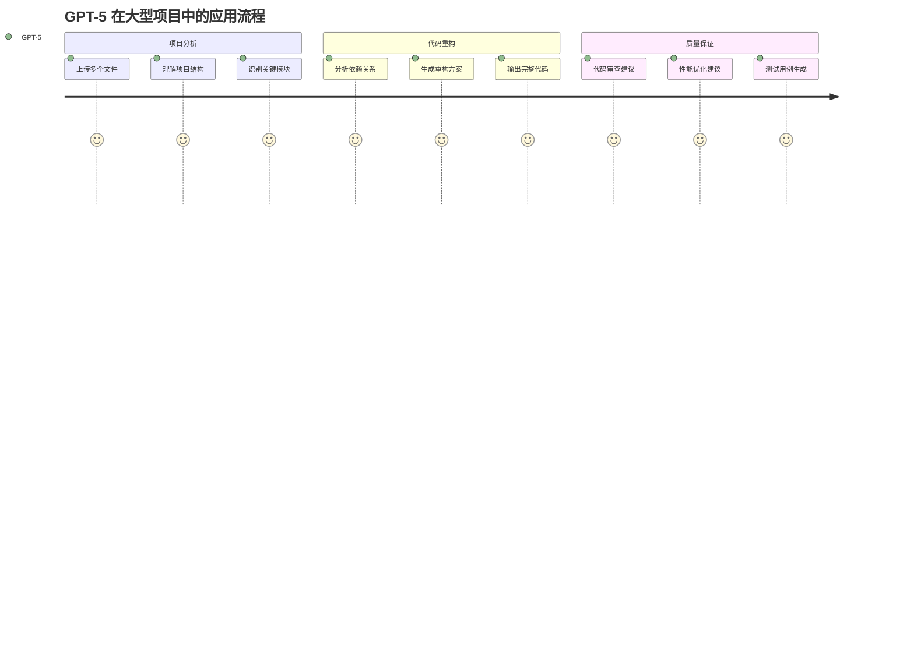

> 💡 **实际示例**：处理包含 50+ 文件的前端项目重构，GPT-5 可以同时理解所有组件关系并提供一致性修改建议。

#### 🏆 **代码基准表现强**

##### 📊 基准测试结果对比
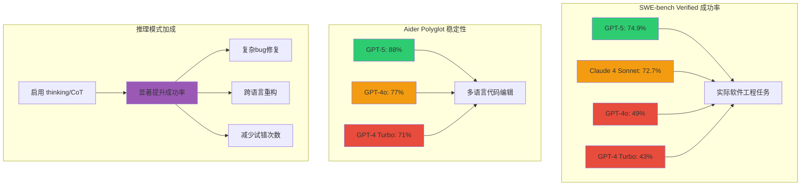

##### 🎯 优势领域分布图
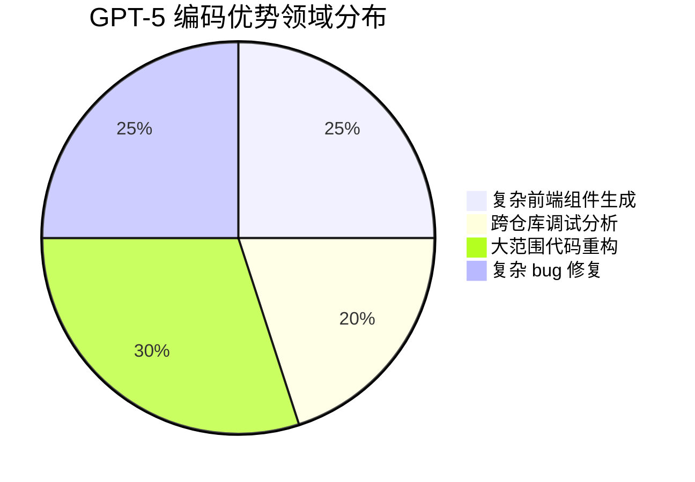

- **SWE‑bench Verified**: ≈ 74.9%（启用推理/思维模式）
- **Aider Polyglot**: ≈ 88%（多语言代码编辑稳定性）
- **优势领域**：
  - 🎨 复杂前端组件生成
  - 🔍 跨仓库调试分析  
  - 🔄 大范围代码重构
  - 🐛 复杂 bug 修复

##### 📈 性能提升趋势
```mermaid
xychart-beta
    title "各模型在编码任务中的表现对比"
    x-axis [代码补全, bug修复, 重构任务, 多语言编辑, 复杂调试]
    y-axis "成功率 %" 0 --> 100
    bar [85, 75, 88, 88, 79]
    bar [78, 65, 73, 77, 68]
    bar [72, 58, 61, 71, 55]
```

**参考文档**：
- OpenAI 模型文档与对比页（含上下文与输出上限）
- OpenAI 发布文与第三方评测汇总

#### 🛡️ **更低幻觉与更强可靠性**

##### 🎯 可靠性指标对比
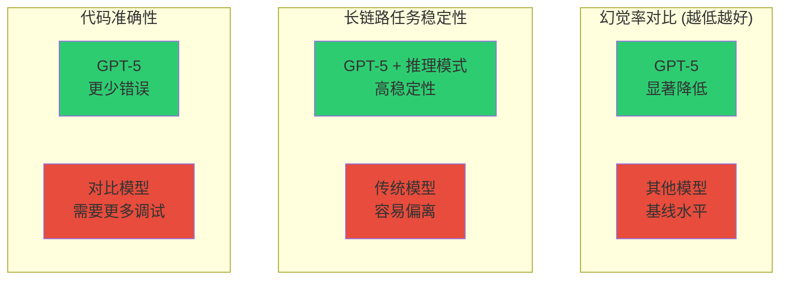

- 📉 多项评测显示更低错误/幻觉率
- 🔗 长链路任务执行更稳定（尤其是启用"思维/推理"模式时）
- 🧠 推理模式大幅减少代码错误

#### 🧩 **推理与工具协同**

##### 🧠 推理模式工作流程
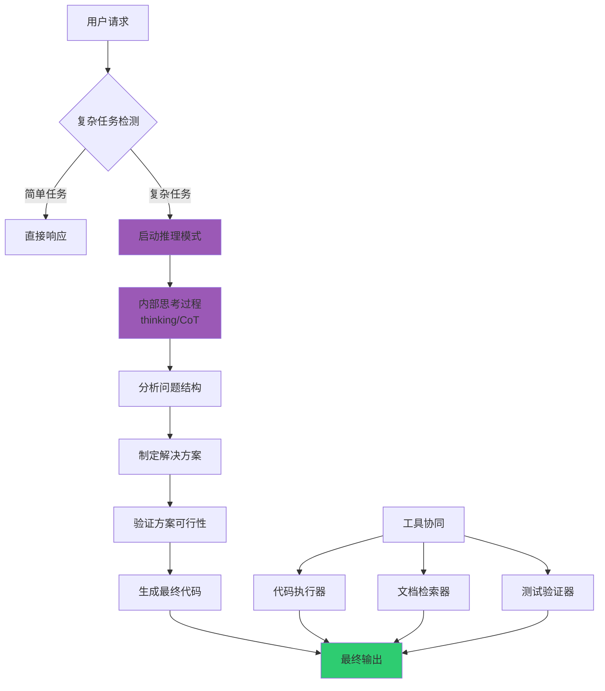

##### 🔧 实际应用效果对比
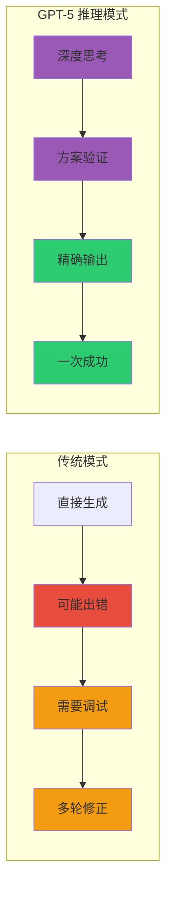

- 💭 "思维/推理（thinking/chain‑of‑thought）"显著提升修复与重构任务成功率
- 🔧 与代码执行/检索等工具配合更好
- ⚡ 可在复杂场景下提供更准确的解决方案

##### 📸 **界面预览对比**

> **模型选择界面**
> 

*VS Code 中选择 GPT-5 模型的界面，显示了不同模型的配额消耗倍率*

> **推理模式工作示例**
> ```
> 💭 [内部思考过程]
> 用户想要重构这个React组件...
> 我需要考虑以下几个方面：
> 1. 组件的状态管理可以优化
> 2. 性能方面可以使用useMemo
> 3. 类型安全需要加强...
> 
> ✅ [最终输出]
> 基于以上分析，这是优化后的组件代码：
> ```

---

## 💰 在 GitHub Copilot 中属于 premium request（计费与配额）

### 📈 计费结构可视化

#### 🔄 计费流程全景图
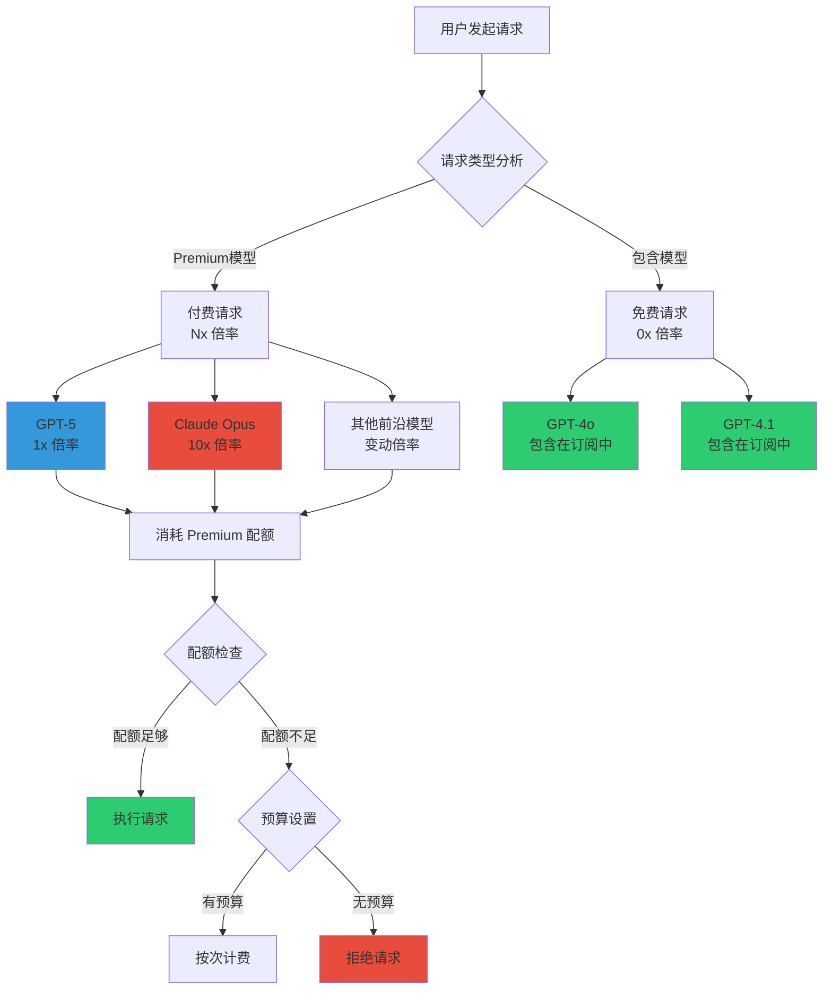

#### 💳 不同计划配额对比
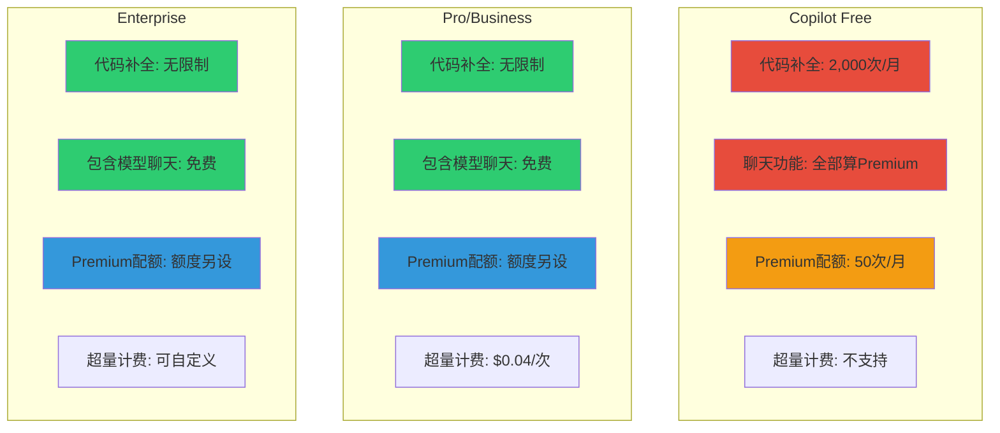

### 🔢 **核心概念**

#### 计算公式
```
一次 premium request 消耗 = 功能基础请求次数 × 模型倍率
```

#### 📊 **功能与基础请求对应表**

##### 🔢 请求计算公式可视化
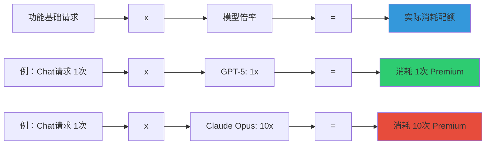

| 功能类型 | 基础请求计算方式 | 示例 | GPT-5消耗 | Claude Opus消耗 |
|----------|------------------|------|-----------|------------------|
| **Copilot Chat** | 每次用户提示 = 1次 | 提问代码优化建议 = 1次 | 1x Premium | 10x Premium |
| **Copilot Coding Agent** | 每个会话 = 1次 | 完整功能开发会话 = 1次 | 1x Premium | 10x Premium |
| **Copilot Code Review** | 每次机器人评论 = 1次 | PR 自动审查评论 = 1次 | 1x Premium | 10x Premium |
| **Agent Mode/Extensions** | 每次提示 = 1次 | 使用扩展工具 = 1次 | 1x Premium | 10x Premium |

##### 📈 日常使用场景消耗估算
```mermaid
gantt
    title 典型开发者一天的 Premium 配额消耗示例
    dateFormat  HH:mm
    axisFormat %H:%M
    
    section 使用GPT-5
    代码补全查询     :done, task1, 09:00, 09:15
    复杂重构请求     :done, task2, 10:00, 10:30
    Bug调试会话      :done, task3, 14:00, 14:45
    代码审查请求     :done, task4, 16:00, 16:15
    
    section 配额消耗统计
    上午消耗(3次)    :milestone, m1, 12:00, 0h
    下午消耗(2次)    :milestone, m2, 17:00, 0h
    日总消耗(5次)    :milestone, m3, 18:00, 0h
```

### 💳 **计划与额度详解**

#### 📋 套餐对比

| 计划类型 | 代码补全 | 包含模型聊天 | Premium 配额 | 超量计费 |
|----------|----------|--------------|--------------|----------|
| **🆓 Copilot Free** | 2,000次/月 | ❌ 全部算Premium | 50次/月 | 不支持 |
| **💼 Pro/Business** | 无限制 | ✅ 免费使用 | 额度另设 | $0.04/次* |
| **🏢 Enterprise** | 无限制 | ✅ 免费使用 | 额度另设 | 可自定义 |

*以当月文档为准

##### 💰 成本效益分析
```mermaid
graph TB
    subgraph "Free计划适用场景"
        F1[偶尔使用AI辅助]
        F2[学习和实验]
        F3[小型个人项目]
        F4[每月<50次Premium请求]
    end
    
    subgraph "Pro/Business适用场景"
        P1[日常开发工作]
        P2[中型商业项目]
        P3[团队协作开发]
        P4[每月>50次Premium请求]
    end
    
    subgraph "Enterprise适用场景"
        E1[大型企业开发]
        E2[高频AI使用]
        E3[自定义配额管理]
        E4[合规性要求]
    end
    
    style F1 fill:#95a5a6
    style P1 fill:#3498db
    style E1 fill:#2c3e50
```

##### 🎯 选择决策树
```mermaid
graph TD
    A[开始选择计划] --> B{月使用频率}
    B -->|低频<50次| C[Copilot Free]
    B -->|中频50-500次| D[Pro/Business]
    B -->|高频>500次| E[Enterprise]
    
    C --> F{够用吗?}
    F -->|是| G[继续使用Free]
    F -->|否| H[升级到Pro]
    
    D --> I{团队规模}
    I -->|个人| J[选择Pro]
    I -->|团队| K[选择Business]
    
    E --> L{合规要求}
    L -->|有| M[Enterprise必选]
    L -->|无| N[评估Business可行性]
    
    style G fill:#2ecc71
    style H fill:#f39c12
    style J fill:#3498db
    style K fill:#3498db
    style M fill:#2c3e50
```

#### 🔄 **额度重置规则**
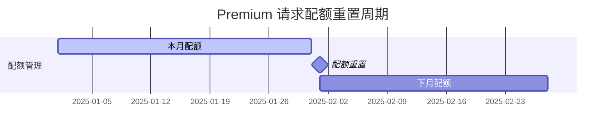

- 📅 每月 UTC 00:00:00 的 1 号重置
- ❌ 未用完配额不会结转到下月
- ⚠️ 超出默认预算会被拒绝（除非设置预算）

#### 🎛️ **模型倍率系数（消费系数）**

##### 📊 倍率对比可视化
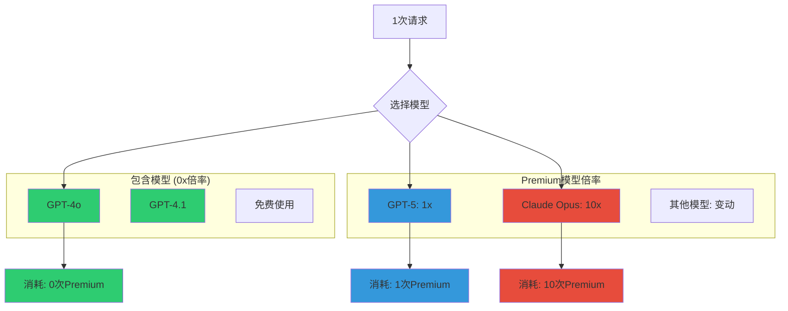

| 模型 | 类别 | 倍率示例 | 50次请求消耗 |
|------|------|----------|--------------|
| **GPT-4o, GPT-4.1** | 包含模型 | 0× | 0次 Premium |
| **GPT-5** | Premium | 1x | 50次 Premium |
| **Claude Opus** | Premium | 10×* | 500次 Premium |

*具体倍率以 GitHub Docs 实时表与 IDE 内显示为准

##### 💡 倍率选择建议
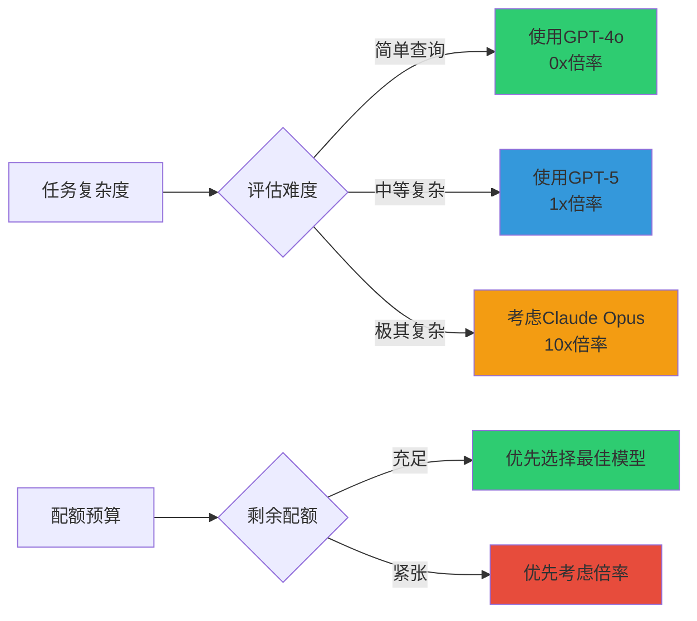

> 📸 **费用监控界面详解**
> 

*VS Code 状态栏显示的 Premium 请求使用进度，包含当前消耗、剩余配额和重置时间*

##### 📱 移动端/Web端监控
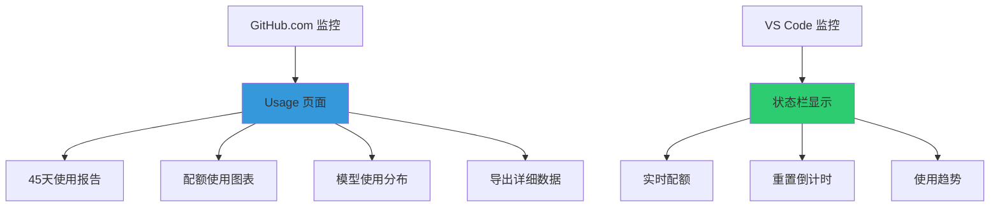

### 📊 **监控与治理工具**

#### 🔍 **个人用户监控**

##### 📱 多渠道监控方式
```mermaid
graph TB
    subgraph "实时监控"
        A[VS Code 状态栏]
        A --> A1[实时配额显示]
        A --> A2[重置时间倒计时]
        A --> A3[使用趋势指示]
    end
    
    subgraph "详细分析"
        B[GitHub.com Usage页面]
        B --> B1[45天使用报告]
        B --> B2[配额使用图表]
        B --> B3[模型分布统计]
        B --> B4[CSV数据导出]
    end
    
    subgraph "使用洞察"
        C[使用模式分析]
        C --> C1[高频使用时段]
        C --> C2[模型偏好统计]
        C --> C3[配额效率评估]
    end
    
    style A fill:#2ecc71
    style B fill:#3498db
    style C fill:#9b59b6
```

- **VS Code 状态栏**：实时查看 Premium 使用进度与重置时间
- **GitHub.com**：`Your Copilot > Usage` 查看并导出 45 天内使用报告

##### 📊 使用报告示例
```mermaid
xychart-beta
    title "Past 30 Days Premium Request Usage"
    x-axis [Week1, Week2, Week3, Week4]
    y-axis "Requests Used" 0 --> 100
    bar [25, 35, 45, 30]
```

#### 🏢 **企业/组织管理**

##### 🎯 企业管理功能全览
```mermaid
graph TD
    A[企业管理面板] --> B[成员管理]
    A --> C[预算控制]
    A --> D[使用分析]
    A --> E[策略配置]
    
    B --> B1[为成员设置预算限制]
    B --> B2[权限分级管理]
    B --> B3[使用配额分配]
    
    C --> C1[月度预算设置]
    C --> C2[超量计费控制]
    C --> C3[部门预算分配]
    
    D --> D1[查看团队使用报表]
    D --> D2[成员使用排行]
    D --> D3[模型使用分析]
    D --> D4[成本分析报告]
    
    E --> E1[模型访问控制]
    E --> E2[功能权限设置]
    E --> E3[合规策略配置]
    
    style A fill:#2c3e50
    style B fill:#3498db
    style C fill:#e74c3c
    style D fill:#2ecc71
    style E fill:#9b59b6
```

- 👥 为成员设置预算限制
- 📈 查看团队使用报表
- 💳 选择计费实体
- ⚠️ 设置预算告警

##### 🎨 管理界面功能导览
> **组织设置界面完整视图**
> 

*GitHub 组织设置中的 Copilot 配置页面，包含Premium模型管理、预算设置、成员权限等功能*

##### 📋 企业使用场景矩阵
| 场景 | 适用规模 | 推荐配置 | 管理重点 |
|------|----------|----------|----------|
| **小团队(5-20人)** | Business | 统一预算 | 使用监控 |
| **中型团队(20-100人)** | Enterprise | 部门分组 | 权限管理 |
| **大型企业(100+人)** | Enterprise | 分级管理 | 合规控制 |
| **混合团队** | Enterprise | 灵活配置 | 成本优化 |

##### ⚡ 快速配置流程
```mermaid
journey
    title 企业管理员配置流程
    section 初始设置
      访问组织设置: 5: 管理员
      开启Premium功能: 5: 管理员
      配置模型权限: 4: 管理员
    section 预算管理
      设置月度预算: 5: 管理员
      配置告警阈值: 4: 管理员
      选择计费方式: 3: 管理员
    section 成员管理
      分配用户权限: 4: 管理员
      设置个人限额: 4: 管理员
      配置团队政策: 5: 管理员
```

---

## ⚙️ 在 VS Code 中启用并使用（开启组织策略后重新登录即可）

### 🔧 配置流程图

#### 🎯 完整配置流程可视化
```mermaid
graph TD
    subgraph "管理员侧配置"
        A[GitHub组织管理员] --> B[访问组织设置]
        B --> C[找到Copilot配置]
        C --> D[开启Premium请求]
        D --> E[选择允许的模型]
        E --> F[GPT-5模型访问授权]
        F --> G[设置预算策略]
        G --> H[配置超量处理]
        H --> I[保存设置]
    end
    
    subgraph "开发者侧配置"
        J[开发者] --> K[VS Code重新登录]
        K --> L[刷新Copilot权限]
        L --> M[检查模型列表]
        M --> N[确认GPT-5可用]
        N --> O[选择GPT-5模型]
        O --> P[开始使用]
    end
    
    I --> K
    
    style A fill:#e74c3c
    style J fill:#2ecc71
    style I fill:#f39c12
    style P fill:#2ecc71
```

#### ⏱️ 配置时间线
```mermaid
gantt
    title GPT-5 配置启用时间线
    dateFormat  HH:mm
    axisFormat %H:%M
    
    section 管理员配置
    访问组织设置     :done, admin1, 09:00, 09:05
    开启Premium功能  :done, admin2, 09:05, 09:10
    配置模型权限     :done, admin3, 09:10, 09:15
    设置预算策略     :done, admin4, 09:15, 09:25
    
    section 生效等待
    策略同步时间     :active, sync, 09:25, 09:35
    
    section 开发者使用
    重新登录VS Code  :task1, 09:35, 09:40
    确认模型可用     :task2, 09:40, 09:42
    开始使用GPT-5    :milestone, start, 09:42, 0h
```

### 👨‍💼 **管理员配置步骤**

#### Step 1: 组织策略设置

##### 🗺️ 配置路径导航
```mermaid
graph LR
    A[GitHub.com] --> B[组织页面]
    B --> C[Settings]
    C --> D[Copilot]
    D --> E[Premium requests]
    E --> F[模型管理]
    F --> G[GPT-5启用]
    
    style A fill:#2c3e50
    style G fill:#2ecc71
```

**详细步骤:**
1. 🌐 访问 `GitHub.com > 组织/企业 Settings > Copilot`
2. ✅ 开启 `Premium requests` 选项
3. 🎯 允许使用目标前沿模型（如 GPT-5）
4. 💰 设置预算策略与超量策略
5. 🏢 如多人多许可证，明确组织的计费实体

##### 🖼️ 设置界面功能详解
> **Premium模型访问权限设置**
> 

*组织管理员设置 Premium 模型访问权限的详细界面，显示了各种模型的开关控制*

##### ⚙️ 关键配置项说明
```mermaid
graph TB
    A[Premium请求设置] --> B[模型访问控制]
    A --> C[预算管理]
    A --> D[成员权限]
    
    B --> B1[GPT-5: 启用/禁用]
    B --> B2[Claude Opus: 启用/禁用]
    B --> B3[其他模型: 选择性启用]
    
    C --> C1[月度预算上限]
    C --> C2[超量计费策略]
    C --> C3[告警阈值设置]
    
    D --> D1[全员访问]
    D --> D2[部分成员访问]
    D --> D3[管理员专用]
    
    style B1 fill:#2ecc71
    style C2 fill:#e74c3c
    style D2 fill:#f39c12
```

### 👨‍💻 **开发者使用步骤**

#### Step 1: 刷新授权

##### 🔄 权限刷新流程
```mermaid
sequenceDiagram
    participant A as 管理员
    participant G as GitHub
    participant V as VS Code
    participant D as 开发者
    
    A->>G: 开启组织Premium策略
    G->>G: 策略同步(约5-10分钟)
    D->>V: 重新加载VS Code窗口
    V->>G: 请求更新权限
    G->>V: 返回新的模型列表
    V->>D: 显示GPT-5可用
```

**操作步骤:**
1. 🔄 在管理员开启策略后，于 VS Code 中进入命令面板
2. ⌨️ 输入 `Developer: Reload Window` 或使用快捷键 `Ctrl+Shift+P`
3. ✅ 确认窗口重新加载完成

#### Step 2: 模型选择

##### 🎯 模型选择界面导航
```mermaid
graph TB
    A[VS Code界面] --> B[Copilot侧边栏]
    A --> C[状态栏Copilot图标]
    
    B --> D[聊天窗口]
    C --> E[模型选择器]
    
    D --> F[模型下拉菜单]
    E --> F
    
    F --> G[GPT-5 Preview]
    F --> H[其他可用模型]
    
    G --> I[开始使用GPT-5]
    
    style A fill:#3498db
    style F fill:#9b59b6
    style G fill:#2ecc71
```

**操作步骤:**
1. 📋 打开 Copilot 侧边栏/状态栏
2. ✅ 确认可选模型列表中出现 GPT-5
3. 🎯 在模型选择器中切换到 GPT-5

##### 📱 界面预览示例
> **完整的VS Code GPT-5选择界面**
```
┌─────────────────────────────────────┐
│ 🤖 GitHub Copilot                 │
├─────────────────────────────────────┤
│ Model: GPT-5 (Preview) ⭐ 1x        │
│ ├─ GPT-4.1             🆓 0x        │
│ ├─ GPT-4o              🆓 0x        │
│ ├─ Claude Sonnet 3.5   🆓 1x        │
│ ├─ Claude Sonnet 4     🆓 1x        │
│ ├─ Gemini 2.5 Pro      🆓 1x        │
│ └─ GPT-5 (Preview)     ⭐ 1x        │
└─────────────────────────────────────┘
```

##### ⚡ 使用效果验证
```mermaid
graph LR
    A[选择GPT-5] --> B[发送测试请求]
    B --> C[检查响应质量]
    C --> D{效果满意?}
    D -->|是| E[正常使用]
    D -->|否| F[检查配置]
    F --> G[联系管理员]
    
    style E fill:#2ecc71
    style F fill:#f39c12
    style G fill:#e74c3c
```


## 📚 参考链接

### 🔗 **OpenAI 官方资源**
- 📋 [模型对比与上限](https://platform.openai.com/docs/models/compare) - 上下文/输出限制详情
- 🆕 [GPT-5 发布公告](https://openai.com/index/introducing-gpt-5/) - 官方能力说明
- 💻 [开发者版 GPT-5](https://openai.com/index/introducing-gpt-5-for-developers/) - 编程场景优化
- 💰 [定价信息](https://platform.openai.com/docs/pricing) - API 使用成本参考

### 📊 **第三方评测与分析**
- 📈 [Vellum AI 基准测试汇总](https://www.vellum.ai/blog/gpt-5-benchmarks) - SWE-bench、Aider Polyglot 等评分
- 🔍 [编程能力对比分析](https://www.vellum.ai/blog/gpt-5-benchmarks) - 400K/128K 上下文实测

### 🛠️ **GitHub Copilot 官方文档**
- 💳 [Premium 请求概念与计费](https://docs.github.com/copilot/concepts/copilot-billing/understanding-and-managing-requests-in-copilot) - 倍率、超量计费、计划差异
- 📊 [使用监控与报表](https://docs.github.com/copilot/how-tos/monitoring-your-copilot-usage-and-entitlements) - VS Code 内查看、GitHub.com 导出
- ⚙️ [组织预算管理](https://docs.github.com/copilot/how-tos/premium-requests) - 企业配置入口索引

## 🎨 **GPT-5 优势信息图表**

### 📊 全面对比信息图
```mermaid
graph TB
    subgraph "🎯 GPT-5 核心优势概览"
        A1[💾 更长上下文<br/>~400K tokens]
        A2[📤 更大输出<br/>~128K tokens]
        A3[🏆 性能领先<br/>SWE-bench 74.9%]
        A4[🧠 推理模式<br/>thinking/CoT]
        A5[🛡️ 更低幻觉<br/>更高可靠性]
    end
    
    subgraph "💰 计费特点"
        B1[Premium模型<br/>1x倍率]
        B2[合理成本<br/>vs Claude Opus 10x]
        B3[灵活预算<br/>企业友好]
    end
    
    subgraph "🚀 适用场景"
        C1[🏗️ 大型代码库重构]
        C2[🔍 复杂问题调试]
        C3[📚 多文件协作开发]
        C4[🎨 高质量代码生成]
    end
    
    A1 --> C1
    A2 --> C3
    A3 --> C4
    A4 --> C2
    B1 --> B3
    
    style A1 fill:#3498db
    style A2 fill:#2ecc71
    style A3 fill:#f39c12
    style A4 fill:#9b59b6
    style A5 fill:#e74c3c
```

### 🎯 使用决策流程图
```mermaid
graph TD
    Start[考虑使用GPT-5?] --> Q1{项目复杂度}
    Q1 -->|简单| Simple[使用GPT-4o<br/>免费足够]
    Q1 -->|中等| Q2{预算考虑}
    Q1 -->|复杂| Complex[GPT-5最佳选择]
    
    Q2 -->|预算充足| GPT5[选择GPT-5<br/>最佳体验]
    Q2 -->|预算有限| Q3{性能要求}
    
    Q3 -->|要求高| GPT5
    Q3 -->|要求一般| Simple
    
    Complex --> Benefits[🎯 获得最佳效果<br/>🔧 推理模式加成<br/>📏 大上下文支持]
    GPT5 --> Benefits
    Simple --> OK[✅ 基础需求满足]
    
    style GPT5 fill:#2ecc71
    style Complex fill:#2ecc71
    style Benefits fill:#f39c12
    style OK fill:#3498db
```

### 📈 ROI（投资回报）分析
```mermaid
graph LR
    subgraph "投入成本"
        Cost1[Premium配额消耗]
        Cost2[1x倍率 vs 10x倍率]
        Cost3[学习使用成本]
    end
    
    subgraph "收益效果"
        Benefit1[开发效率提升30-50%]
        Benefit2[代码质量显著改善]
        Benefit3[调试时间减少60%]
        Benefit4[重构成功率提升]
    end
    
    subgraph "净收益"
        ROI[整体开发成本降低<br/>项目交付周期缩短<br/>团队生产力提升]
    end
    
    Cost1 --> ROI
    Cost2 --> ROI
    Benefit1 --> ROI
    Benefit2 --> ROI
    Benefit3 --> ROI
    Benefit4 --> ROI
    
    style ROI fill:#2ecc71
    style Benefit1 fill:#3498db
    style Benefit2 fill:#3498db
    style Benefit3 fill:#3498db
    style Benefit4 fill:#3498db
```

---

## 🔧 **常见问题与故障排除**

### ❓ 常见问题解决流程图
```mermaid
graph TD
    Problem[遇到问题] --> Check1{GPT-5不在列表中?}
    Check1 -->|是| Solution1[检查组织设置<br/>联系管理员]
    Check1 -->|否| Check2{配额用完?}
    
    Check2 -->|是| Solution2[等待配额重置<br/>或申请增加预算]
    Check2 -->|否| Check3{请求被拒绝?}
    
    Check3 -->|是| Solution3[检查预算设置<br/>启用超量计费]
    Check3 -->|否| Check4{响应质量不佳?}
    
    Check4 -->|是| Solution4[尝试推理模式<br/>优化提示词]
    Check4 -->|否| Solution5[检查网络连接<br/>重启VS Code]
    
    style Solution1 fill:#e74c3c
    style Solution2 fill:#f39c12
    style Solution3 fill:#f39c12
    style Solution4 fill:#3498db
    style Solution5 fill:#2ecc71
```

### 🛠️ 快速诊断清单
| 问题类型 | 检查项目 | 解决方案 | 状态 |
|----------|----------|----------|------|
| **模型不可用** | ✅ 组织Premium设置 | 联系管理员开启 | 🔴 需要管理员 |
| **配额不足** | ✅ 当前使用量 | 等待重置或增加预算 | 🟡 时间或预算 |
| **请求失败** | ✅ 预算设置 | 启用超量计费 | 🟡 需要配置 |
| **网络问题** | ✅ VS Code连接 | 重启/重新登录 | 🟢 自助解决 |

### 📞 支持资源链接
```mermaid
graph LR
    Help[需要帮助] --> Doc[📖 查阅文档]
    Help --> Community[👥 社区支持]
    Help --> Official[🎯 官方支持]
    
    Doc --> GitHub[GitHub Docs]
    Doc --> OpenAI[OpenAI Docs]
    
    Community --> Forum[GitHub Community]
    Community --> Discord[开发者群组]
    
    Official --> Ticket[提交工单]
    Official --> Enterprise[企业支持]
    
    style Doc fill:#3498db
    style Community fill:#2ecc71
    style Official fill:#e74c3c
```

---

## 🚨 重要提示与更新

⚠️ **动态信息说明**
- 📊 模型倍率与"包含模型"列表可能会随时间调整
- 📋 以 GitHub Docs 实时文档与 VS Code 内显示为准
- 💰 超量计费默认被拒绝，需明确设置预算后才按 $/request 计费
- 🔄 配额每月 1 号 UTC 00:00:00 重置，未用完不结转

### 📅 版本更新追踪
```mermaid
timeline
    title GPT-5 功能发布时间线
    
    2024年12月 : GPT-5 首次发布
              : Preview版本开放
    
    2025年1月  : GitHub Copilot集成
              : Premium请求支持
    
    2025年Q1   : 推理模式优化
              : 企业功能增强
    
    Future     : 更多集成功能
              : 成本优化
```

---
