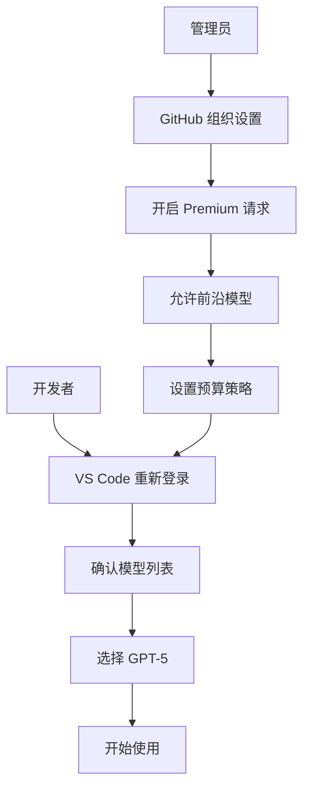
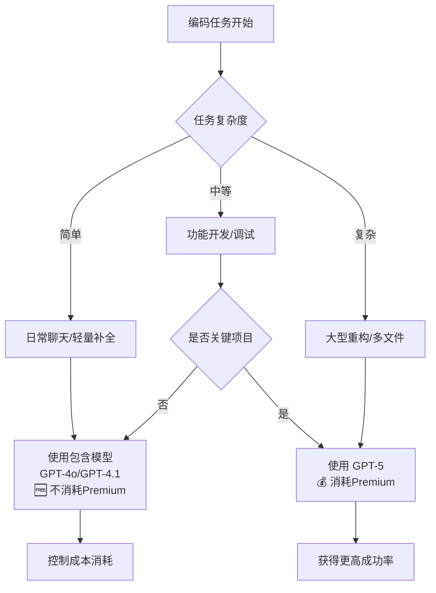

# 🚀 GPT‑5 编码优势与在 GitHub Copilot 中的 premium request 说明

> **TL;DR** GPT-5 在 GitHub Copilot 中提供更强的代码能力和更长的上下文，但作为 premium 模型需要额外配额。本文档提供完整的使用指南和多媒体说明。

## 📋 目录导航
- [🎯 为什么选择 GPT‑5](#-为什么在编码场景选择-gpt5)
- [💰 Premium 请求计费说明](#-在-github-copilot-中属于-premium-request计费与配额)
- [⚙️ VS Code 配置使用](#️-在-vs-code-中启用并使用开启组织策略后重新登录即可)
- [🎯 选型建议](#-快速选型建议)
- [📚 参考资源](#-参考链接)

## 🎯 为什么在编码场景选择 GPT‑5

### 📊 核心优势对比

| 特性 | GPT-5 | GPT-4o | GPT-4 Turbo |
|------|-------|--------|-------------|
| **上下文窗口** | ~400K tokens | 128K tokens | 128K tokens |
| **最大输出** | ~128K tokens | 4K tokens | 4K tokens |
| **SWE-bench Verified** | 74.9%* | ~49% | ~43% |
| **Aider Polyglot** | 88%* | ~77% | ~71% |
| **推理模式** | ✅ 支持 | ❌ 不支持 | ❌ 不支持 |

*启用推理/思维模式时的表现


### 🔍 详细能力分析

#### 💾 **更长上下文与更大输出**
- **上下文窗口**：约 400K tokens，相当于约 30万字的代码文档
- **最大输出**：约 128K tokens，可一次性生成大型功能模块
- **适用场景**：
  - 🏗️ 大型代码库分析与重构
  - 📚 多文件协作开发
  - 🔧 长对话调试与问题定位

> 💡 **实际示例**：处理包含 50+ 文件的前端项目重构，GPT-5 可以同时理解所有组件关系并提供一致性修改建议。

#### 🏆 **代码基准表现强**


- **SWE‑bench Verified**: ≈ 74.9%（启用推理/思维模式）
- **Aider Polyglot**: ≈ 88%（多语言代码编辑稳定性）
- **优势领域**：
  - 🎨 复杂前端组件生成
  - 🔍 跨仓库调试分析  
  - 🔄 大范围代码重构
  - 🐛 复杂 bug 修复

**参考文档**：
- OpenAI 模型文档与对比页（含上下文与输出上限）
- OpenAI 发布文与第三方评测汇总

#### 🛡️ **更低幻觉与更强可靠性**
- 📉 多项评测显示更低错误/幻觉率
- 🔗 长链路任务执行更稳定（尤其是启用"思维/推理"模式时）
- 🧠 推理模式大幅减少代码错误

#### 🧩 **推理与工具协同**
- 💭 "思维/推理（thinking/chain‑of‑thought）"显著提升修复与重构任务成功率
- 🔧 与代码执行/检索等工具配合更好
- ⚡ 可在复杂场景下提供更准确的解决方案

> 📸 **界面预览**
> 
> *VS Code 中选择 GPT-5 模型的界面*

---

## 💰 在 GitHub Copilot 中属于 premium request（计费与配额）

### 📈 计费结构可视化


### 🔢 **核心概念**

#### 计算公式
```
一次 premium request 消耗 = 功能基础请求次数 × 模型倍率
```

#### 📊 **功能与基础请求对应表**

| 功能类型 | 基础请求计算方式 | 示例 |
|----------|------------------|------|
| **Copilot Chat** | 每次用户提示 = 1次 | 提问代码优化建议 = 1次 |
| **Copilot Coding Agent** | 每个会话 = 1次 | 完整功能开发会话 = 1次 |
| **Copilot Code Review** | 每次机器人评论 = 1次 | PR 自动审查评论 = 1次 |
| **Agent Mode/Extensions** | 每次提示 = 1次 | 使用扩展工具 = 1次 |

### 💳 **计划与额度详解**

#### 📋 套餐对比

| 计划类型 | 代码补全 | 包含模型聊天 | Premium 配额 | 超量计费 |
|----------|----------|--------------|--------------|----------|
| **🆓 Copilot Free** | 2,000次/月 | ❌ 全部算Premium | 50次/月 | 不支持 |
| **💼 Pro/Business** | 无限制 | ✅ 免费使用 | 额度另设 | $0.04/次* |
| **🏢 Enterprise** | 无限制 | ✅ 免费使用 | 额度另设 | 可自定义 |

*以当月文档为准

#### 🔄 **额度重置规则**


- 📅 每月 UTC 00:00:00 的 1 号重置
- ❌ 未用完配额不会结转到下月
- ⚠️ 超出默认预算会被拒绝（除非设置预算）

#### 🎛️ **模型倍率系数（消费系数）**

| 模型 | 类别 | 倍率示例 | 说明 |
|------|------|----------|------|
| **GPT-4o, GPT-4.1** | 包含模型 | 0× | 付费计划下免费 |
| **GPT-5** | Premium | 参考文档 | 前沿模型，计入配额 |
| **Claude Opus** | Premium | 10×* | 官方示例倍率 |

*具体倍率以 GitHub Docs 实时表与 IDE 内显示为准

> 📸 **费用监控界面**
> 
> *VS Code 状态栏显示的 Premium 请求使用进度*

### 📊 **监控与治理工具**

#### 🔍 **个人用户监控**
- **VS Code 状态栏**：实时查看 Premium 使用进度与重置时间
- **GitHub.com**：`Your Copilot > Usage` 查看并导出 45 天内使用报告

#### 🏢 **企业/组织管理**
- 👥 为成员设置预算限制
- 📈 查看团队使用报表
- 💳 选择计费实体（多人多许可证场景）
- ⚠️ 设置预算告警

> 📸 **管理界面示例**
> 
> *GitHub 组织设置中的 Copilot 配置页面*

---

## ⚙️ 在 VS Code 中启用并使用（开启组织策略后重新登录即可）

### 🔧 配置流程图



### 👨‍💼 **管理员配置步骤**

#### Step 1: 组织策略设置
1. 🌐 访问 `GitHub.com > 组织/企业 Settings > Copilot`
2. ✅ 开启 `Premium requests` 选项
3. 🎯 允许使用目标前沿模型（如 GPT-5）
4. 💰 设置预算策略与超量策略
5. 🏢 如多人多许可证，明确组织的计费实体

> 📸 **设置界面**
> 
> *组织管理员设置 Premium 模型访问权限*

#### Step 2: 预算管理
```yaml
# 预算配置示例
budget_settings:
  monthly_limit: "$100"
  overage_policy: "allow_with_billing"  # 或 "block"
  alert_threshold: 80%  # 80% 时发送告警
  billing_entity: "organization"  # 或具体团队
```

### 👨‍💻 **开发者使用步骤**

#### Step 1: 刷新授权
1. 🔄 在管理员开启策略后，于 VS Code 中"注销并重新登录"GitHub 账户
2. 📝 命令面板执行 `GitHub: Sign out` → `GitHub: Sign in`
3. 🔄 或直接重载窗口刷新授权状态

#### Step 2: 模型选择
1. 📋 打开 Copilot 侧边栏/状态栏
2. ✅ 确认可选模型列表中出现 GPT-5
3. 🎯 在模型选择器中切换到 GPT-5

#### Step 3: 使用监控
1. 📊 点击状态栏 Copilot 图标查看"Premium requests"用量进度
2. 🌐 必要时在 `GitHub.com > Your Copilot > Usage` 核对额度与重置时间

> 📸 **使用界面截图系列**
> 
> 
> *在 VS Code 中选择 GPT-5 模型*
> 
> 
> *实时查看 Premium 请求使用情况*

### 🛠️ **快速验证清单**

- [ ] 管理员已开启组织 Premium 请求策略
- [ ] 开发者已重新登录 GitHub 账户
- [ ] VS Code 中可选择 GPT-5 模型
- [ ] 状态栏显示 Premium 请求配额信息
- [ ] 首次使用 GPT-5 成功且计入配额

---

## 🎯 快速选型建议

### 📋 使用场景决策树



### 💡 **具体建议**

#### 🔥 **优先使用 GPT-5 的场景**
- 🏗️ **长上下文/长输出需求**：大型代码库重构、多文件关联修改
- 🔍 **复杂调试任务**：跨模块问题定位、性能瓶颈分析
- 🎨 **高质量代码生成**：关键业务逻辑、复杂算法实现
- 📊 **企业关键项目**：生产环境代码、核心功能开发

#### 💰 **使用包含模型的场景**
- 💬 **日常聊天交流**：代码解释、学习问答
- ⚡ **轻量代码补全**：变量命名、简单函数实现
- 🔧 **非关键开发**：测试代码、文档编写
- 🎯 **成本敏感项目**：个人项目、学习练习

#### 🏢 **企业治理建议**
- 👑 **关键团队**：配置更高预算、更高等级计划
- 📊 **启用监控**：团队使用报表、超量告警
- 🎯 **分层策略**：核心开发用 GPT-5，其他场景用包含模型
- 💡 **培训指导**：团队成员了解使用场景与成本控制

### 📊 **成本效益分析表**

| 使用模式 | Premium 消耗 | 代码质量 | 开发效率 | 推荐场景 |
|----------|-------------|----------|----------|----------|
| **全程 GPT-5** | ⬆️⬆️⬆️ 高 | ⬆️⬆️⬆️ 极高 | ⬆️⬆️⬆️ 极高 | 关键项目、复杂任务 |
| **混合使用** | ⬆️⬆️ 中等 | ⬆️⬆️ 高 | ⬆️⬆️ 高 | **🎯 推荐平衡方案** |
| **仅包含模型** | ✅ 零消耗 | ⬆️ 良好 | ⬆️ 良好 | 成本敏感、日常开发 |

---

## 📚 参考链接

### 🔗 **OpenAI 官方资源**
- 📋 [模型对比与上限](https://platform.openai.com/docs/models/compare) - 上下文/输出限制详情
- 🆕 [GPT-5 发布公告](https://openai.com/index/introducing-gpt-5/) - 官方能力说明
- 💻 [开发者版 GPT-5](https://openai.com/index/introducing-gpt-5-for-developers/) - 编程场景优化
- 💰 [定价信息](https://platform.openai.com/docs/pricing) - API 使用成本参考

### 📊 **第三方评测与分析**
- 📈 [Vellum AI 基准测试汇总](https://www.vellum.ai/blog/gpt-5-benchmarks) - SWE-bench、Aider Polyglot 等评分
- 🔍 [编程能力对比分析](https://www.vellum.ai/blog/gpt-5-benchmarks) - 400K/128K 上下文实测

### 🛠️ **GitHub Copilot 官方文档**
- 💳 [Premium 请求概念与计费](https://docs.github.com/copilot/concepts/copilot-billing/understanding-and-managing-requests-in-copilot) - 倍率、超量计费、计划差异
- 📊 [使用监控与报表](https://docs.github.com/copilot/how-tos/monitoring-your-copilot-usage-and-entitlements) - VS Code 内查看、GitHub.com 导出
- ⚙️ [组织预算管理](https://docs.github.com/copilot/how-tos/premium-requests) - 企业配置入口索引

### 🎥 **演示与教程资源**

> 📹 **视频教程（待补充）**
> - GPT-5 在 VS Code 中的设置演示
> - Premium 请求监控与成本控制
> - 大型项目重构实战案例

> 🖼️ **信息图表**
> 
> *全面对比 GPT-5 与其他模型的能力指标*

---

## 🚨 重要提示与更新

⚠️ **动态信息说明**
- 📊 模型倍率与"包含模型"列表会随时间调整
- 📋 以 GitHub Docs 实时文档与 VS Code 内显示为准
- 💰 超量计费默认被拒绝，需明确设置预算后才按 $/request 计费
- 🔄 配额每月 1 号 UTC 00:00:00 重置，未用完不结转

💡 **获取最新信息**
- 🌐 定期查看 GitHub Copilot 官方文档更新
- 📱 关注 GitHub 博客与产品公告
- 💬 参与 GitHub Discussion 社区交流

---

📅 **文档版本信息**
- 📝 创建时间：2025年1月
- 🔄 最后更新：2025年1月
- 👥 维护者：GitHub Copilot Sharing 社区
- 📧 反馈建议：通过主仓库 Issue 提交

> 🎯 **下一步行动**
> 1. 📋 检查组织 Premium 策略设置
> 2. 🔄 VS Code 重新登录刷新权限  
> 3. 🎯 选择 GPT-5 开始体验强化编码能力
> 4. 📊 监控使用量合理控制成本

---