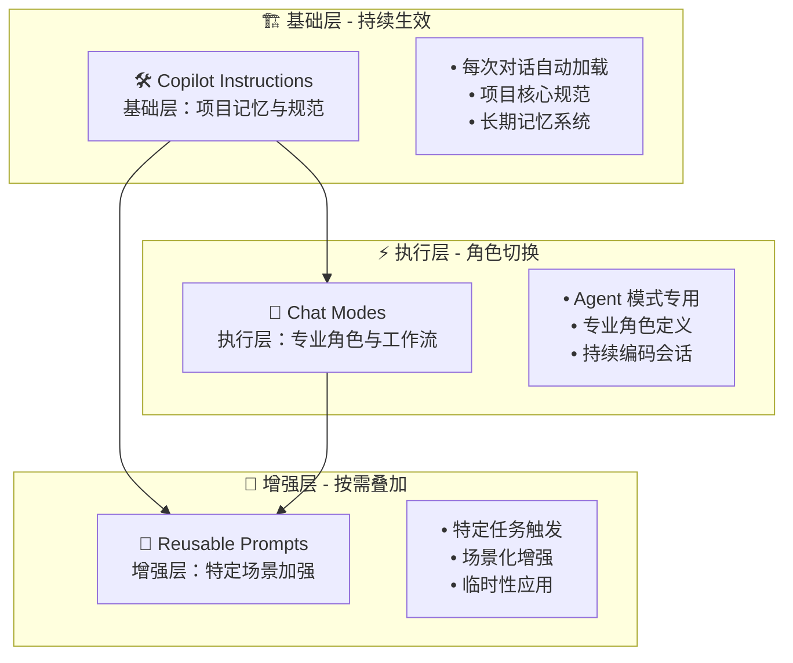
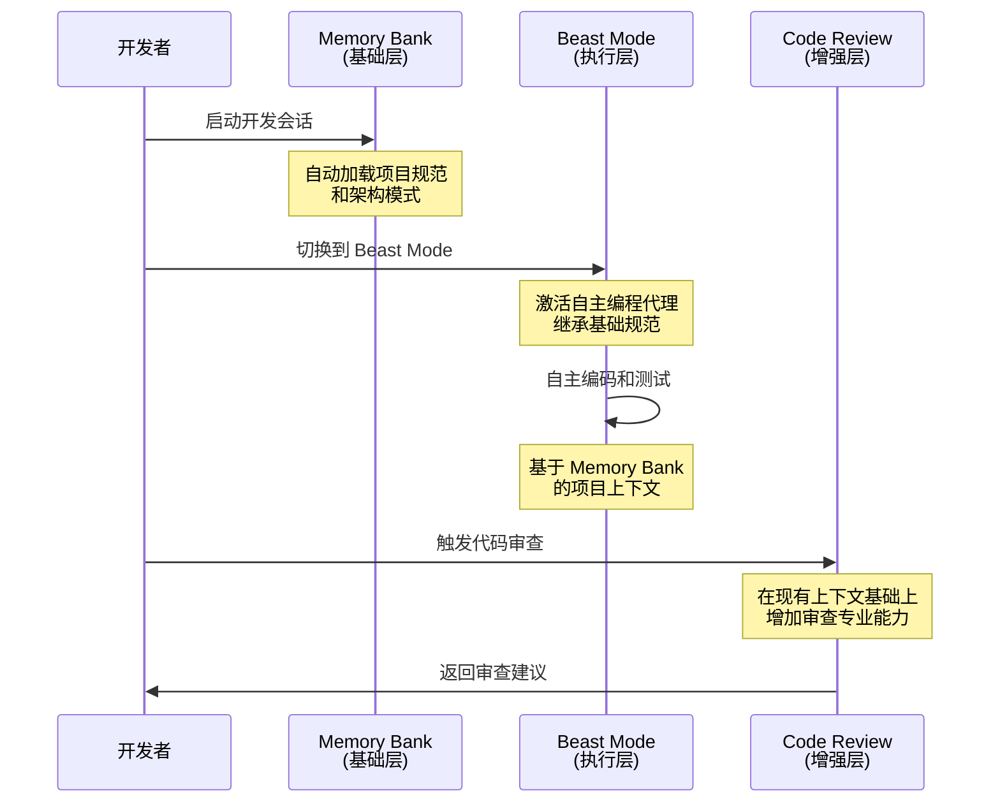
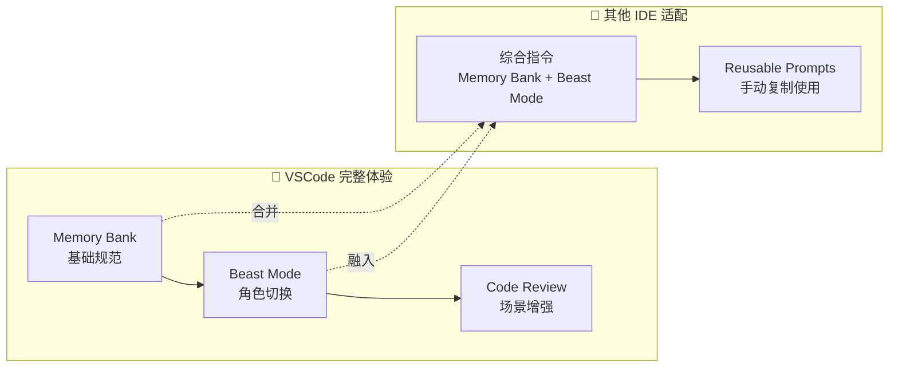
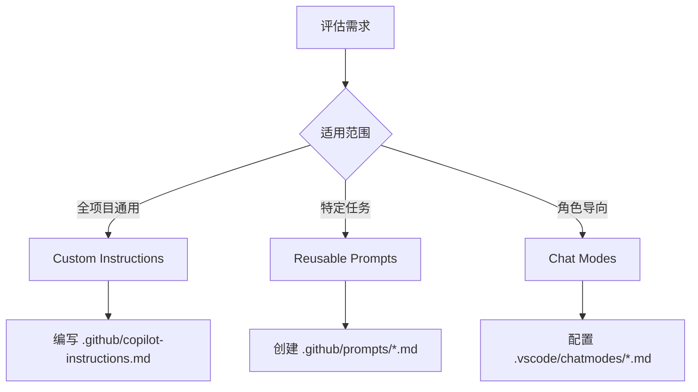

# 🚀 GitHub Copilot 自定义 Prompts 提升性能指南

> 🎯 **释放 AI 编程的真正潜力！** 通过自定义 Prompts、指令和聊天模式，让 GitHub Copilot 更好地理解你的项目需求，提供更精确、更符合团队标准的代码建议。 先快速看看有哪几种自定义方式。 在文章后半部分，我们会去拆解好的实践案例，同时不同场景下采用何种模式

## 🌟 为什么需要自定义 Prompts？

### 📈 默认 vs 自定义的全面对比

| 对比维度 | 默认 GitHub Copilot | 自定义 Prompts |
|---------|-------------------|----------------|
| **代码风格** | 通用编程风格 | 团队特定的编码规范 | 
| **架构理解** | 基础架构模式 | 项目特定的架构和设计模式式 |
| **业务逻辑** | 通用业务场景 | 领域特定的业务规则和逻辑为 AI 指导 |
| **工具集成** | 标准工具使用 | 项目需要特定的工具链和框架(MCP或 Extension) |
| **一致性** | 可能存在不一致 | 确保团队代码一致性 | 
| **安全性** | 基础安全实践 | 内置安全最佳实践和风险防护护 |
| **效率** | 基础代码生成 | 高效的项目导向解决方案 | 

## 📋 GitHub Copilot 三种自定义模式

| 自定义方式 | 🛠️ Copilot Instructions<br/>（自定义指令） | 🎯 Reusable Prompts<br/>（可复用提示词） | 🧩 Chat Modes<br/>（聊天模式） |
|-----------|----------------------------------|-----------------------------------|----------------------------|
| **定义** | 为任务（代码生成、审查、提交消息）提供通用指导原则 | 创建可复用的、独立的特定任务提示词 | 定义聊天行为、可用工具和代码库交互模式 |
| **核心特点** | • 自动包含在每个聊天请求中<br/>• 仓库级别的一致性<br/>• 支持多种实现方式 | • 消除重复的提示词编写<br/>• 支持变量和依赖关系<br/>• 团队间可共享 | • 上下文感知辅助<br/>• 工具配置<br/>• 角色特定工作流 |
| **主要使用场景** | • 团队编码规范<br/>• 项目架构指导<br/>• 安全最佳实践<br/>• 通用开发流程 | • 代码审查模板<br/>• 文档生成<br/>• 测试用例创建<br/>• 架构设计 | • 专家顾问模式<br/>• 调试助手<br/>• 代码重构向导<br/>• 性能优化顾问 |
| **文件位置** | `.github/copilot-instructions.md` | `.github/prompts/*.md` | `.vscode/chatmodes/*.md` |
| **生效范围** | 全局（所有聊天请求） | 按需调用（特定任务） | 会话级别（特定角色） |
| **配置复杂度** | 简单 | 中等 | 复杂 |

上述的 Copilot Instructions 模式在 VSCode, JetBrains, VS, XCode 和 WebBrowser 都支持。另外两种模式，目前只有 VSCode 支持。
此三种模式仅适用于 GitHub Copilot Chat 功能, 代码补全尚不支持。

另外，GitHub Copilot 还支持组织级别的 Custom Instructions, 但它目前只适用于 GitHub 网站上的 Copilot 回答。这里就不做过多介绍。 更多请参考 https://docs.github.com/en/enterprise-cloud@latest/copilot/how-tos/configure-custom-instructions/add-organization-instructions


## 🎨 三种 Prompts 模式的协作架构

### 📐 协作关系概览

三种自定义模式形成了一个完整的 AI 编程辅助生态系统，每种模式承担不同的职责，相互补充，缺一不可。以下用 Memory Bank, Beast Mode 及 Code Review 来说明它们的协作关系。



### 🛠️ Memory Bank - 基础层：项目长期记忆
**类型**：Copilot Instructions  
**位置**：`.github/copilot-instructions.md`

```yaml
applyTo: '**'
description: '项目记忆和上下文连续性系统'
```

**核心价值**：
- **🔄 持续生效**：每次 Chat 对话都自动加载，无需手动激活
- **📚 项目记忆**：记录项目架构、系统设计、业务逻辑、任务跟踪
- **🏗️ 基础规范**：为所有后续对话提供一致的上下文基础

**文档结构**：
```markdown
1. projectbrief.md - 项目核心定义
2. systemPatterns.md - 架构模式与技术决策
3. activeContext.md - 当前开发焦点
4. progress.md - 项目进度与状态
```

### 🦁 Beast Mode - 执行层：自主编程代理
**类型**：Chat Modes  
**位置**：`.vscode/chatmodes/Beast.chatmode.md`

```yaml
description: 'Claude Sonnet 4 作为顶级编程代理'
model: Claude Sonnet 4
title: 'Beast Mode'
```

**核心价值**：
- **🎯 角色专精**：切换为专业的自主编程代理角色
- **⚡ 持续会话**：在 Agent 模式下替换默认行为
- **🔧 工作流定制**：定义特定的工作模式和工具使用规范

**核心特性**：
- 自主解决复杂编程问题
- 必须进行广泛的互联网研究
- 通过工具进行严格的代码测试
- 递归收集所有相关信息

### 🔍 Code Review Changes - 增强层：特定场景加强
**类型**：Reusable Prompts  
**位置**：`.github/prompts/code-review-changes.md`

```yaml
mode: 'agent'
description: '增量代码变更审查，生成针对性审查建议'
```

**核心价值**：
- **🎯 场景专用**：专门针对代码审查场景的增强指令
- **📊 按需叠加**：在需要代码审查时手动激活
- **🔧 流程标准化**：标准化特定任务的执行流程

**工作流程**：
1. 变更收集：使用 `changes` 工具获取代码变更
2. 影响分析：分析变更对现有代码的影响
3. 质量评估：检查代码质量和潜在问题
4. 建议生成：提供具体的改进建议

### 🔗 三种模式的协作场景

#### 场景 1：复杂功能开发


#### 场景 2：非 VSCode IDE 的综合指令
对于不支持 Chat Modes 的 IDE（如 JetBrains、Visual Studio），需要将多种指令合并到 Copilot Instructions 中：



### 💡 三种模式的重要性

| 缺失模式 | 后果 | 实际影响 |
|---------|------|----------|
| **缺少 Memory Bank** | 每次对话重新解释项目 | 效率下降，一致性差 |
| **缺少 Chat Modes** | 无法切换专业角色 | 专业与逻辑能力不足，代码质量下降 |
| **缺少 Reusable Prompts** | 重复编写相同指令 | 标准化差，效率下降 |

**最佳实践**：
1. **Memory Bank 作为基石** - 确保每次对话都有项目上下文
2. **Chat Modes 提供专业性** - 根据任务切换到最适合的角色
3. **Reusable Prompts 场景加强** - 在特定场景下叠加专业能力


## 🔧 实施步骤指南

### 第一步：评估当前需求
1. **分析项目特点**：技术栈、架构模式、业务领域
2. **识别痛点**：代码质量、一致性、效率问题
3. **确定优先级**：最需要改进的方面

### 第二步：选择自定义方式


### 第三步：制定对应的 Prompts

**类型**：Copilot Instructions  
**位置**：`.github/copilot-instructions.md`

**文件头部配置要点**：
- `applyTo: '**'` - 应用到所有文件类型
- 无需其他 YAML 参数，直接使用 Markdown 内容
- 自动在每次 Chat 会话中加载

**类型**：Chat Modes  
**位置**：`.vscode/chatmodes/XXX.chatmode.md`

**文件头部配置要点**：
- `description` - Chat Mode 的简短描述
- `model` - 指定使用的 AI 模型（Claude Sonnet 4）
- `title` - 模式名称
- 文件扩展名必须是 `.chatmode.md`，文件名前缀为 Chat 面板显示的名称

**类型**：Reusable Prompts  
**位置**：`.github/prompts/code-review-changes.md`

**文件头部配置要点**：
- `mode: 'agent'` - 指定为代理模式
- `description` - 详细功能描述
- `tools` - 可用的工具列表（如 changes、codebase 等）
---
> **在 Prompt 的正文中， 可以根据场景的需要让 Copilot 调用合适的工具，这些工具可以是 Copilot 内置的（如 changes, codebase 等），也可以是你自己定义的 MCP 工具，也可以 Copilot Extension 提供的工具**。


更多的 Prompt files 可参考[awesome-copilot](https://github.com/github/awesome-copilot/tree/main)
---

> 💡 **成功秘诀**：好的自定义 Prompts 不是一次性工作，而是持续迭代和优化的过程。从小处开始，逐步完善，让 AI 真正成为你团队的智能编程伙伴。

> 📅 **最后更新**：2025年8月 