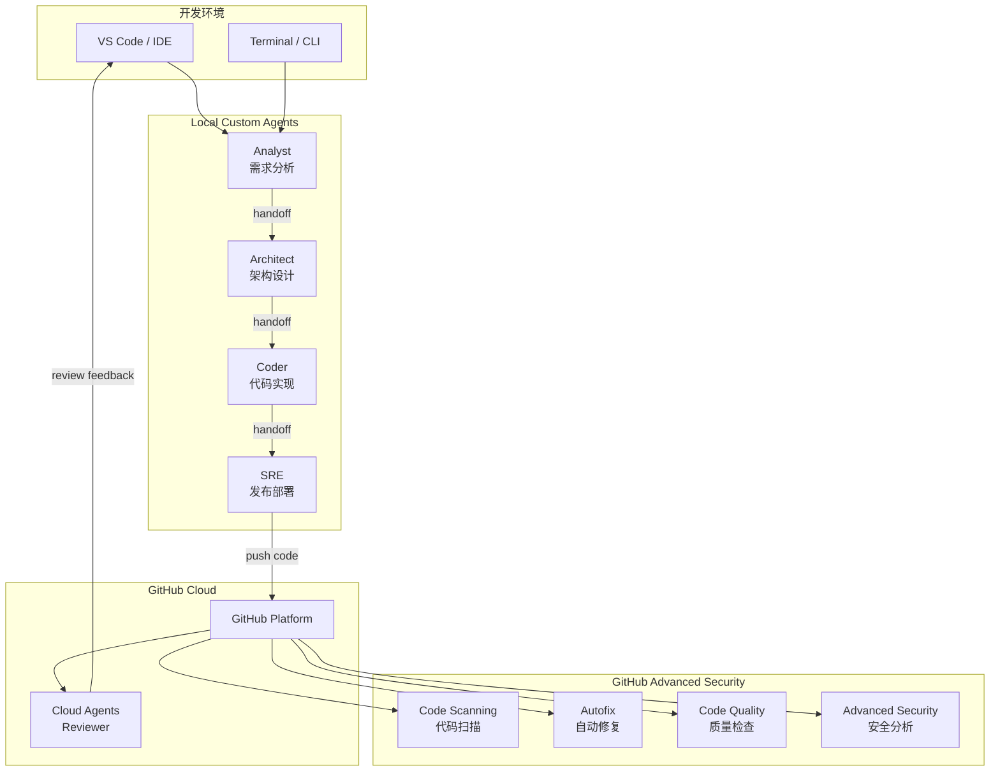
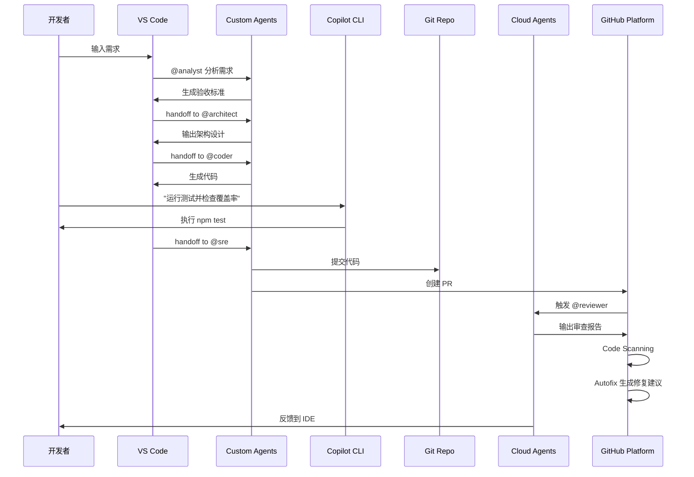
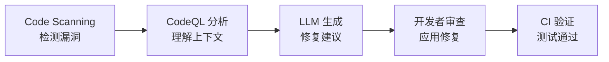

# GitHub Copilot Agents 完整开发工作流实战 Lab

## Lab 概述

本 Lab 将通过构建一个 **OKR 管理应用**，展示如何使用 GitHub Copilot 的三大 Agent 类型（Custom Agents、Cloud Agents、Copilot CLI）配合 GitHub Advanced Security 特性，实现从需求分析到代码审查、安全扫描的完整 AI 驱动开发流程。

**学习目标：**
- 理解 GitHub Copilot Agents 的三种类型及其适用场景
- 掌握 Custom Agents 在本地 IDE 中的协作开发流程
- 学习使用 Cloud Agents 进行代码审查
- 了解 Copilot CLI 在终端中的应用
- 实践 GitHub Advanced Security 功能（Code Scanning、Code Quality、Autofix）
- 构建完整的 AI 驱动 DevSecOps 工作流

**预计时间：** 2-3 小时

---

## 第一部分：GitHub Copilot Agents 架构与类型

### 1.1 Agents 架构概览

GitHub Copilot Agents 是基于大语言模型的智能助手，能够理解上下文、执行任务并与开发者协作。根据部署位置和使用场景，分为三种类型：



---

### 1.2 Custom Agents（本地自定义 Agents）

**定义：** 存储在项目仓库 `.github/agents/` 目录下的 Markdown 文件，在本地 IDE 中运行。

**特点：**
- ✅ 完全可定制，适配团队特定工作流
- ✅ 离线可用（依赖本地模型）
- ✅ 支持 Agent 间协作（handoff 机制）
- ✅ 访问本地文件系统和工具链
- ✅ 保护敏感代码（不上传到云端）

**适用场景：**
- 团队特定的开发规范和流程
- 需要访问本地资源（数据库、配置文件）
- 敏感项目的代码生成
- 复杂的多步骤开发任务

**本 Lab 定义的 Custom Agents：**

| Agent | 职责 | 输入 | 输出 | Handoff |
|-------|------|------|------|---------|
| **Analyst** | 需求分析 | 用户故事 | 验收标准、接口初稿 | → Architect |
| **Architect** | 架构设计 | 需求分析 | 架构设计、技术选型、任务清单 | → Coder |
| **Coder** | 代码实现 | 架构设计 | 完整代码、测试、部署配置 | → SRE |
| **SRE** | 发布部署 | 实现代码 | CI/CD 配置、PR 创建 | - |

**配置位置：** `.github/agents/*.agent.md`

---

### 1.3 Cloud Agents（云端 Agents）

**定义：** 托管在 GitHub 组织级别 `.github-private` 仓库中的 Agents，通过 GitHub 云服务运行。

**特点：**
- ✅ 组织级共享，统一标准
- ✅ 无需本地配置，开箱即用
- ✅ 集成 GitHub 平台能力（API、Webhooks）
- ✅ 支持跨仓库协作
- ✅ 自动更新，版本集中管理

**适用场景：**
- 组织级代码审查标准
- 跨项目的安全检查
- 统一的合规性验证
- 自动化的协作流程

**本 Lab 定义的 Cloud Agent：**

| Agent | 职责 | 触发时机 | 功能 |
|-------|------|----------|------|
| **Reviewer** | 代码审查 | PR 创建时 | 代码质量检查、安全扫描、CodeQL 分析 |

**配置位置：** GitHub Org `/.github-private/agents/reviewer.agent.md`

---

### 1.4 Copilot CLI（命令行助手）

**定义：** 在终端中运行的 AI 助手，也称为 **Copilot Background Session**。

**特点：**
- ✅ 自然语言转命令行
- ✅ 实时上下文感知（当前目录、Git 状态）
- ✅ 支持复杂命令组合
- ✅ 解释命令含义和风险
- ✅ 脚本生成与调试

**适用场景：**
- Git 操作（分支管理、合并冲突）
- 系统管理任务
- 快速脚本编写
- 命令行工具学习

**使用示例：**
```bash
# 启动 Copilot CLI
copilot

# 自然语言提问
> "列出所有未合并的分支"
> "创建一个 PR 到 main 分支"
> "生成一个备份脚本"
```

---

### 1.5 三种 Agents 的协作模式



---

## 第二部分：GitHub Advanced Security 功能详解

### 2.1 GitHub Advanced Security 概述

GitHub Advanced Security (GHAS) 是 GitHub 的企业级安全解决方案，提供全面的代码安全和质量保障。

**核心组件：**

| 功能 | 描述 | 免费范围 |
|------|------|----------|
| **Code Scanning** | 静态代码分析，检测安全漏洞 | ✅ 公开仓库 |
| **Secret Scanning** | 扫描提交中的密钥和凭证 | ✅ 公开仓库 |
| **Dependency Review** | 依赖项漏洞检测 | ✅ 公开仓库 |
| **Copilot Autofix** | AI 驱动的漏洞自动修复 | ✅ 公开仓库<br/>✅ 企业私有仓库 |
| **Code Quality** | 代码质量问题检测 | 🔒 公开预览 |

**许可要求：**
- 公开仓库：免费使用所有功能
- 私有仓库：需要 GitHub Enterprise + GHAS 许可

---

### 2.2 Code Scanning（代码扫描）

**工作原理：**
Code Scanning 使用 CodeQL（GitHub 的语义代码分析引擎）扫描代码库，识别：
- 安全漏洞（CWE 分类）
- 代码质量问题
- 最佳实践偏差

**支持语言：**
- JavaScript/TypeScript
- Python
- Java/Kotlin
- C/C++/C#
- Go
- Ruby

**配置方式：**

```yaml
# .github/workflows/codeql-analysis.yml
name: "CodeQL"

on:
  push:
    branches: [ main ]
  pull_request:
    branches: [ main ]
  schedule:
    - cron: '0 0 * * 1'  # 每周一运行

jobs:
  analyze:
    name: Analyze
    runs-on: ubuntu-latest
    permissions:
      actions: read
      contents: read
      security-events: write

    strategy:
      matrix:
        language: [ 'javascript', 'typescript' ]

    steps:
    - name: Checkout repository
      uses: actions/checkout@v4

    - name: Initialize CodeQL
      uses: github/codeql-action/init@v3
      with:
        languages: ${{ matrix.language }}
        queries: security-extended  # 使用扩展安全查询

    - name: Autobuild
      uses: github/codeql-action/autobuild@v3

    - name: Perform CodeQL Analysis
      uses: github/codeql-action/analyze@v3
```

**常见漏洞类型：**

| CWE | 漏洞类型 | 示例 |
|-----|---------|------|
| CWE-79 | XSS 跨站脚本 | 未转义的用户输入渲染到 HTML |
| CWE-89 | SQL 注入 | 拼接 SQL 字符串 |
| CWE-78 | 命令注入 | 未验证的 shell 命令执行 |
| CWE-22 | 路径遍历 | 未过滤的文件路径访问 |
| CWE-798 | 硬编码凭证 | 代码中的密码/API Key |
| CWE-502 | 不安全反序列化 | eval() 执行用户输入 |

---

### 2.3 Copilot Autofix（自动修复）

**核心价值：**
传统的安全扫描只告诉你"有问题"，但 Autofix 直接给出"如何修复"的代码建议。

**工作流程：**



**触发条件：**
- Pull Request 中检测到漏洞
- 自动生成修复建议（通常在几秒内）
- 以 PR Comment 形式展示

**示例：SQL 注入修复**

**原始代码（存在漏洞）：**
```typescript
// ❌ 不安全：直接拼接 SQL
app.get('/users/:id', (req, res) => {
  const userId = req.params.id;
  const query = `SELECT * FROM users WHERE id = ${userId}`;
  db.query(query, (err, result) => {
    res.json(result);
  });
});
```

**Autofix 建议：**
```typescript
// ✅ 安全：使用参数化查询
app.get('/users/:id', (req, res) => {
  const userId = req.params.id;
  const query = 'SELECT * FROM users WHERE id = ?';
  db.query(query, [userId], (err, result) => {
    res.json(result);
  });
});
```

**负责任的使用原则：**
1. **始终审查 Autofix 建议** - AI 可能产生不完美的修复
2. **验证业务逻辑** - 确保修复不破坏功能
3. **运行完整测试** - CI 必须通过
4. **理解修复原理** - 学习安全编码最佳实践

---

### 2.4 Code Quality（代码质量检查）

**功能范围（公开预览）：**
- 代码复杂度分析
- 代码异味检测（Code Smells）
- 可维护性评分
- 重复代码识别

**集成方式：**
Code Quality 作为 Code Scanning 的扩展，无需额外配置，自动在 PR 中显示质量问题。

**质量问题示例：**
- 过长的函数（> 50 行）
- 深层嵌套（> 4 层）
- 未使用的变量
- 魔法数字（Magic Numbers）
- 缺少错误处理

---

### 2.5 实战配置清单

**启用 GHAS 的步骤：**

1. **仓库设置**：
   - Settings → Security → Code security and analysis
   - 启用 "CodeQL analysis"
   - 启用 "Dependency graph"
   - 启用 "Dependabot alerts"

2. **配置 Workflow**：
   - 添加 `.github/workflows/codeql-analysis.yml`
   - 添加 `.github/workflows/security.yml`（依赖扫描）

3. **设置分支保护**：
   - Settings → Branches → Add rule
   - 要求 "Code scanning results" 通过
   - 要求 "Status checks" 通过

4. **配置通知**：
   - Settings → Notifications
   - 订阅 Security alerts

---

## 第三部分：实战项目 - OKR 管理应用

### 3.1 项目需求

**项目背景：**
构建一个轻量级的 OKR（Objectives and Key Results）管理系统，支持团队设定目标、追踪关键结果进度。

**核心功能：**
1. **Objective 管理**
   - 创建目标（标题、描述、截止日期）
   - 查询目标列表
   - 更新目标状态

2. **Key Result 管理**
   - 为目标添加关键结果
   - 更新进度（0-100%）
   - 自动计算目标完成度

3. **数据持久化**
   - 使用内存存储（简化 Lab）
   - 支持导出 JSON

**技术约束：**
- 后端：Node.js 22 + TypeScript + Express
- 数据验证：Zod
- 测试：Vitest
- 部署：Docker + Kubernetes

---

### 3.2 完整开发流程（使用 Custom Agents）

#### Step 1: 需求分析（@analyst）

**在 VS Code 中操作：**

1. 打开 Copilot Chat
2. 输入：`@analyst 我需要开发一个 OKR 管理应用，支持创建目标、添加关键结果、追踪进度。请进行需求分析。`

**Analyst 的输出（写入 `thinking/analyst.md`）：**

```markdown
## 需求分析与核心逻辑

### 用户故事拆解
1. **US-1**: As a 团队成员, I want to 创建 Objective, so that 明确团队季度目标
2. **US-2**: As a 团队成员, I want to 为 Objective 添加 Key Results, so that 量化目标达成标准
3. **US-3**: As a 团队成员, I want to 更新 Key Result 进度, so that 实时追踪目标完成情况

### 核心实体
- **Objective**: { id, title, description, deadline, status, progress }
- **KeyResult**: { id, objectiveId, title, target, current, unit, progress }

### 关键业务流程
1. 创建 Objective → 生成 ID → 存储 → 返回创建结果
2. 添加 Key Result → 验证 Objective 存在 → 存储 → 更新 Objective 进度
3. 更新 Key Result → 验证权限 → 更新进度 → 重新计算 Objective 进度

## 验收标准
1. ✅ 创建 Objective 时，必填字段验证正确（title, deadline）
2. ✅ Key Result 的 current 值不能超过 target
3. ✅ Objective 的 progress 自动计算为所有 Key Results 的平均进度
4. ✅ 删除 Objective 时，关联的 Key Results 自动删除
5. ✅ API 返回统一的错误格式

## 接口初稿

### POST /api/objectives
创建目标
- Request: { title: string, description?: string, deadline: string }
- Response: { id: string, ...objective }
- Status: 201 Created / 400 Bad Request

### GET /api/objectives
查询目标列表
- Response: { objectives: Objective[] }
- Status: 200 OK

### POST /api/objectives/:id/key-results
添加关键结果
- Request: { title: string, target: number, unit: string }
- Response: { id: string, ...keyResult }
- Status: 201 Created / 404 Not Found

### PATCH /api/key-results/:id
更新关键结果进度
- Request: { current: number }
- Response: { ...keyResult }
- Status: 200 OK / 404 Not Found

## 错误与状态码约定
- 错误结构: { code: string, message: string }
- InvalidInput (400): 非法输入
- NotFound (404): 资源不存在
- InternalError (500): 内部错误
```

**Analyst 自动 handoff 到 Architect**

---

#### Step 2: 架构设计（@architect）

**Architect 自动接收任务，输出到 `thinking/architect.md`：**

```markdown
## 架构设计与技术选型

### 技术栈
- **后端**: Node.js 22 + TypeScript + Express
- **数据验证**: Zod
- **测试**: Vitest
- **构建**: esbuild
- **容器**: Docker (multi-stage)
- **部署**: Kubernetes

### 架构模式
采用三层架构（Controller - Service - Repository）

### 数据模型

```typescript
interface Objective {
  id: string;
  title: string;
  description?: string;
  deadline: string;  // ISO 8601
  status: 'active' | 'completed' | 'archived';
  progress: number;  // 0-100
  createdAt: string;
  updatedAt: string;
}

interface KeyResult {
  id: string;
  objectiveId: string;
  title: string;
  target: number;
  current: number;
  unit: string;  // e.g., "users", "%", "MRR"
  progress: number;  // (current / target) * 100
  createdAt: string;
  updatedAt: string;
}
```

### 项目结构
```
okr-system/
├── src/
│   ├── models/          # 数据模型定义
│   ├── repositories/    # 数据访问层
│   ├── services/        # 业务逻辑层
│   ├── controllers/     # 路由控制器
│   ├── schemas/         # Zod 验证模式
│   ├── utils/           # 工具函数
│   └── index.ts         # 入口
├── tests/               # 测试文件
├── k8s/                 # K8s 配置
├── Dockerfile
└── package.json
```

## 开发任务清单
- [ ] Task 1: 项目初始化（tsconfig, package.json, eslint）
- [ ] Task 2: 定义数据模型（Objective, KeyResult）
- [ ] Task 3: 实现 Repository 层（内存存储）
- [ ] Task 4: 实现 Service 层（业务逻辑）
- [ ] Task 5: 实现 Controller 层（API 路由）
- [ ] Task 6: 编写单元测试（覆盖率 > 80%）
- [ ] Task 7: 创建 Dockerfile
- [ ] Task 8: 创建 K8s Manifests
```

**Architect 自动 handoff 到 Coder**

---

#### Step 3: 代码实现（@coder）

**Coder 执行所有任务，生成完整代码：**

**核心代码示例（`src/services/ObjectiveService.ts`）：**

```typescript
import { v4 as uuidv4 } from 'uuid';
import { Objective, CreateObjectiveInput } from '../models/Objective';
import { ObjectiveRepository } from '../repositories/ObjectiveRepository';
import { KeyResultRepository } from '../repositories/KeyResultRepository';

export class ObjectiveService {
  constructor(
    private objectiveRepo: ObjectiveRepository,
    private keyResultRepo: KeyResultRepository
  ) {}

  async createObjective(input: CreateObjectiveInput): Promise<Objective> {
    const objective: Objective = {
      id: uuidv4(),
      title: input.title,
      description: input.description,
      deadline: input.deadline,
      status: 'active',
      progress: 0,
      createdAt: new Date().toISOString(),
      updatedAt: new Date().toISOString(),
    };
    
    return this.objectiveRepo.save(objective);
  }

  async updateObjectiveProgress(objectiveId: string): Promise<void> {
    const keyResults = await this.keyResultRepo.findByObjectiveId(objectiveId);
    
    if (keyResults.length === 0) {
      return;
    }
    
    const avgProgress = keyResults.reduce((sum, kr) => sum + kr.progress, 0) / keyResults.length;
    
    await this.objectiveRepo.updateProgress(objectiveId, Math.round(avgProgress));
  }

  async getObjectives(): Promise<Objective[]> {
    return this.objectiveRepo.findAll();
  }
}
```

**测试示例（`tests/ObjectiveService.test.ts`）：**

```typescript
import { describe, it, expect, beforeEach } from 'vitest';
import { ObjectiveService } from '../src/services/ObjectiveService';
import { InMemoryObjectiveRepository } from '../src/repositories/InMemoryObjectiveRepository';
import { InMemoryKeyResultRepository } from '../src/repositories/InMemoryKeyResultRepository';

describe('ObjectiveService', () => {
  let service: ObjectiveService;
  
  beforeEach(() => {
    const objRepo = new InMemoryObjectiveRepository();
    const krRepo = new InMemoryKeyResultRepository();
    service = new ObjectiveService(objRepo, krRepo);
  });

  it('should create objective with default progress 0', async () => {
    const input = {
      title: 'Increase user engagement',
      deadline: '2025-12-31',
    };
    
    const result = await service.createObjective(input);
    
    expect(result.id).toBeDefined();
    expect(result.title).toBe(input.title);
    expect(result.progress).toBe(0);
    expect(result.status).toBe('active');
  });
});
```

**Coder 输出到 `thinking/coder.md`：**

```markdown
## 实现完成报告

### Git 分支
- **分支名**: `feature/okr-management-system`
- **提交内容**: 完整的 OKR 系统实现，包含测试和部署配置

### 测试覆盖率
- 单元测试覆盖率: 85%
- 集成测试: 8 个测试用例全部通过

### 部署配置
- Dockerfile: 多阶段构建，生产镜像 < 100MB
- K8s Deployment: 3 副本，配置探针
- K8s Service: LoadBalancer 暴露 80 端口

### 本地验证
```bash
# 安装依赖
npm install

# 运行测试
npm test

# 启动服务
npm run dev

# 冒烟测试
curl -X POST http://localhost:3000/api/objectives \
  -H "Content-Type: application/json" \
  -d '{"title":"Q1 Growth","deadline":"2025-03-31"}'
```
```

**Coder 自动 handoff 到 SRE**

---

#### Step 4: 发布部署（@sre）

**SRE 生成 CI/CD 配置：**

**`.github/workflows/ci.yml`：**

```yaml
name: CI

on:
  pull_request:
    branches: [ main ]

jobs:
  test:
    runs-on: ubuntu-latest
    steps:
    - uses: actions/checkout@v4
    
    - name: Setup Node.js
      uses: actions/setup-node@v4
      with:
        node-version: '22'
        cache: 'npm'
    
    - name: Install dependencies
      run: npm ci
    
    - name: Lint
      run: npm run lint
    
    - name: Type check
      run: npm run typecheck
    
    - name: Run tests
      run: npm test -- --coverage
    
    - name: Upload coverage
      uses: codecov/codecov-action@v4
      with:
        files: ./coverage/coverage-final.json
```

**`.github/workflows/cd.yml`：**

```yaml
name: CD

on:
  push:
    branches: [ main ]
    tags: [ 'v*' ]

jobs:
  deploy:
    runs-on: ubuntu-latest
    steps:
    - uses: actions/checkout@v4
    
    - name: Set image tag
      id: image_tag
      run: |
        if [[ $GITHUB_REF == refs/tags/* ]]; then
          echo "tag=${GITHUB_REF#refs/tags/}" >> $GITHUB_OUTPUT
        else
          echo "tag=$(git rev-parse --short HEAD)" >> $GITHUB_OUTPUT
        fi
    
    - name: Build Docker image
      run: |
        docker build -t ghcr.io/${{ github.repository }}/okr-system:${{ steps.image_tag.outputs.tag }} .
    
    - name: Login to GitHub Container Registry
      uses: docker/login-action@v3
      with:
        registry: ghcr.io
        username: ${{ github.actor }}
        password: ${{ secrets.GITHUB_TOKEN }}
    
    - name: Push image
      run: docker push ghcr.io/${{ github.repository }}/okr-system:${{ steps.image_tag.outputs.tag }}
    
    - name: Configure kubectl
      run: |
        mkdir -p ~/.kube
        echo "${{ secrets.KUBE_CONFIG }}" | base64 -d > ~/.kube/config
    
    - name: Update deployment image
      run: |
        sed -i "s|__IMAGE_TAG__|${{ steps.image_tag.outputs.tag }}|g" k8s/deployment.yaml
        kubectl apply -f k8s/
    
    - name: Wait for rollout
      run: kubectl rollout status deployment/okr-system -n okr-system --timeout=300s
    
    - name: Health check
      run: |
        EXTERNAL_IP=$(kubectl get svc okr-service -n okr-system -o jsonpath='{.status.loadBalancer.ingress[0].ip}')
        curl -f http://${EXTERNAL_IP}/health || exit 1
```

**SRE 创建 Pull Request，输出到 `thinking/sre.md`**

---

### 3.3 使用 Copilot CLI 辅助开发

**场景 1: Git 分支管理**

```bash
# 启动 Copilot CLI
gh copilot

# 自然语言提问
> "创建一个新分支用于 OKR 功能开发"

# Copilot 输出
$ git checkout -b feature/okr-management-system

# 执行确认
> yes
```

**场景 2: 查看测试覆盖率**

```bash
> "运行测试并显示覆盖率报告"

# Copilot 输出
$ npm test -- --coverage && open coverage/index.html
```

**场景 3: 快速脚本生成**

```bash
> "生成一个脚本，备份所有 thinking 目录下的 markdown 文件"

# Copilot 输出
$ tar -czf thinking-backup-$(date +%Y%m%d).tar.gz thinking/*.md
```

---

## 第四部分：Cloud Agent 代码审查

### 4.1 配置 Reviewer Agent（组织级）

**在 GitHub Organization 中创建 `.github-private` 仓库：**

结构：
```
.github-private/
└── agents/
    └── reviewer.agent.md
```

**Reviewer Agent 自动在 PR 创建时触发**

---

### 4.2 Reviewer 审查流程

**当 SRE 创建 PR 后，Reviewer 自动执行：**

1. **获取变更：**
```bash
git diff main...feature/okr-management-system
```

2. **代码质量检查：**
   - ✅ 命名规范：驼峰式，语义清晰
   - ✅ 错误处理：所有异步函数都有 try-catch
   - ⚠️  建议：`ObjectiveService` 的 `updateObjectiveProgress` 方法可提取为独立函数

3. **安全扫描（CodeQL）：**
```bash
codeql database create codeql-db --language=javascript --source-root=.
codeql database analyze codeql-db \
  --format=sarif-latest \
  --output=results.sarif \
  codeql/javascript-queries:codeql-suites/javascript-security-extended.qls
```

4. **输出审查报告（作为 PR Comment）：**

```markdown
## 🤖 Reviewer Agent 代码审查报告

### 变更概览
- **分支**: feature/okr-management-system → main
- **提交数**: 12 commits
- **变更文件数**: 23 files
- **代码行数**: +1,245 / -0

### ✅ 优点
- 代码结构清晰，三层架构分离良好
- 测试覆盖率达到 85%，超过预期
- 使用 Zod 进行输入验证，类型安全

### ⚠️ 改进建议

| 优先级 | 文件 | 行号 | 问题描述 | 建议 |
|-------|------|-----|---------|-----|
| Medium | src/services/ObjectiveService.ts | 42 | 进度计算逻辑重复 | 提取为 `calculateAverageProgress()` 工具函数 |
| Low | src/controllers/ObjectiveController.ts | 15 | 缺少请求日志 | 添加结构化日志（如 pino） |

### 🔒 安全扫描报告

#### 扫描结果
- **工具**: CodeQL
- **查询套件**: javascript-security-extended
- **扫描时间**: 2025-12-03 06:00

#### ✅ 无高危漏洞
- 未发现 SQL 注入、XSS、命令注入等高危漏洞
- 未发现硬编码凭证

### 审查结论

**审查状态**: ✅ 批准合并

**总结**:
- 代码质量评分: 8.5/10
- 安全风险等级: Low
- 建议: 可直接合并，改进建议可在后续迭代中优化

### 后续行动
- [ ] 合并 PR
- [ ] 触发 CD 流水线
- [ ] 验证生产环境健康状态
```

---

## 第五部分：GitHub Advanced Security 实战

### 5.1 启用 Code Scanning

**在 GitHub 仓库中配置：**

1. 进入 **Settings → Security → Code security and analysis**
2. 点击 **Set up** 按钮（Code scanning）
3. 选择 **Advanced** → 创建自定义 workflow
4. 使用本 Lab 第 2.2 节提供的 `codeql-analysis.yml` 配置

---

### 5.2 模拟漏洞并测试 Autofix

**在代码中故意引入 SQL 注入漏洞：**

```typescript
// src/controllers/ObjectiveController.ts（故意的漏洞代码）
app.get('/api/objectives/search', (req, res) => {
  const keyword = req.query.keyword;
  const query = `SELECT * FROM objectives WHERE title LIKE '%${keyword}%'`;  // ❌ SQL 注入
  db.query(query, (err, results) => {
    res.json(results);
  });
});
```

**创建 PR 后，观察 Code Scanning 结果：**

1. PR 页面会显示 **Code scanning alert**：
   - **漏洞类型**: SQL Injection (CWE-089)
   - **严重性**: Critical
   - **位置**: src/controllers/ObjectiveController.ts:42

2. 点击 **View details** 查看详细分析

3. **Autofix 自动生成修复建议**：

```typescript
// Copilot Autofix 建议的修复
app.get('/api/objectives/search', (req, res) => {
  const keyword = req.query.keyword as string;
  const query = 'SELECT * FROM objectives WHERE title LIKE ?';  // ✅ 参数化查询
  db.query(query, [`%${keyword}%`], (err, results) => {
    if (err) {
      return res.status(500).json({ code: 'InternalError', message: 'Database query failed' });
    }
    res.json(results);
  });
});
```

4. **应用修复**：
   - 点击 **Apply fix** 按钮
   - Autofix 会自动创建一个新的 commit
   - CI 重新运行，验证修复有效

---

### 5.3 Code Quality 检查

**Code Quality 会自动在 PR 中标记质量问题：**

**示例问题：**

1. **复杂度过高：**
```typescript
// ⚠️ Code Quality Alert: Cyclomatic complexity = 15
function processObjective(obj: Objective) {
  if (obj.status === 'active') {
    if (obj.progress >= 100) {
      if (obj.deadline > new Date().toISOString()) {
        // ... 深层嵌套逻辑
      }
    }
  }
}
```

**修复建议：**
```typescript
// ✅ 提前返回，降低复杂度
function processObjective(obj: Objective) {
  if (obj.status !== 'active') return;
  if (obj.progress < 100) return;
  if (obj.deadline <= new Date().toISOString()) return;
  
  // 主逻辑
}
```

2. **未使用的变量：**
```typescript
// ⚠️ Code Quality Alert: Unused variable
const unusedVar = fetchSomeData();
```

---

### 5.4 设置分支保护规则

**确保代码质量和安全检查强制执行：**

1. **Settings → Branches → Add rule**
2. **Branch name pattern**: `main`
3. **勾选以下选项**：
   - ✅ Require status checks to pass before merging
     - ✅ CI (test, lint, typecheck)
     - ✅ CodeQL
   - ✅ Require code scanning results
   - ✅ Require pull request reviews before merging
   - ✅ Dismiss stale pull request approvals when new commits are pushed

---

## 第六部分：完整工作流演示

### 6.1 端到端流程图

```mermaid
graph TB
    Start([开发者输入需求]) --> A1[@analyst<br/>需求分析]
    A1 --> |thinking/analyst.md| A2[@architect<br/>架构设计]
    A2 --> |thinking/architect.md| A3[@coder<br/>代码实现]
    A3 --> |thinking/coder.md| A4[@sre<br/>CI/CD 配置]
    
    A4 --> Git[创建 Git 分支<br/>提交代码]
    Git --> PR[创建 Pull Request]
    
    PR --> CI[GitHub Actions CI<br/>运行测试]
    PR --> CS[Code Scanning<br/>CodeQL 分析]
    PR --> CA[@reviewer<br/>代码审查]
    
    CS --> AF{发现漏洞?}
    AF --> |是| Autofix[Copilot Autofix<br/>生成修复建议]
    Autofix --> Dev[开发者审查并应用]
    Dev --> CI
    
    AF --> |否| Merge{审查通过?}
    CI --> Merge
    CA --> Merge
    
    Merge --> |是| CD[GitHub Actions CD<br/>构建镜像]
    CD --> K8s[部署到 Kubernetes]
    K8s --> Health[健康检查]
    Health --> Done([部署完成])
    
    Merge --> |否| Fix[修复问题]
    Fix --> Git
```

---

### 6.2 实战演练步骤

**Step 1: 克隆 Lab 仓库**
```bash
git clone https://github.com/<your-org>/okr-lab
cd okr-lab
```

**Step 2: 配置 Custom Agents**
```bash
# 确保 .github/agents/ 目录下有以下文件：
# - analyst.agent.md
# - architect.agent.md
# - coder.agent.md
# - sre.agent.md
```

**Step 3: 启动需求分析**
在 VS Code 中：
1. 打开 Copilot Chat (`Cmd/Ctrl + Shift + I`)
2. 输入：`@analyst 开发 OKR 管理应用，需求见 README.md`
3. 等待 Analyst 完成分析并 handoff

**Step 4: 依次执行 Architect → Coder → SRE**
每个 Agent 会自动 handoff 到下一个，无需人工干预。

**Step 5: 使用 Copilot CLI 辅助**
```bash
gh copilot

> "检查当前分支状态并推送到远程"
> "创建 PR 到 main 分支，标题为 'feat: Implement OKR management system'"
```

**Step 6: 等待 Cloud Reviewer 审查**
PR 创建后，@reviewer 会自动运行并发布审查报告。

**Step 7: 处理 Code Scanning 结果**
如果发现漏洞，查看 Autofix 建议并应用修复。

**Step 8: 合并 PR 并部署**
所有检查通过后，合并 PR，CD 流水线自动部署到 K8s。

**Step 9: 验证部署**
```bash
# 获取 LoadBalancer IP
kubectl get svc okr-service -n okr-system

# 测试 API
curl http://<EXTERNAL-IP>/api/objectives
```

---

## 第七部分：最佳实践与常见问题

### 7.1 Custom Agents 最佳实践

1. **清晰的职责分离**
   - 每个 Agent 专注单一领域
   - 避免职责重叠

2. **完善的 Handoff 机制**
   - 明确定义输入输出格式
   - 使用 `thinking/` 目录作为交接文档

3. **上下文管理**
   - 在 Agent 配置中引用项目文档
   - 提供必要的示例和约束

4. **迭代优化**
   - 根据实际使用效果调整 Agent prompt
   - 记录常见问题并更新指令

---

### 7.2 Cloud Agents 最佳实践

1. **组织级标准化**
   - 统一代码审查标准
   - 定期更新 Agent 配置

2. **权限管理**
   - 限制 `.github-private` 仓库访问权限
   - 审计 Agent 执行日志

3. **性能优化**
   - 避免 Agent 执行耗时操作
   - 使用缓存减少重复分析

---

### 7.3 Copilot CLI 使用技巧

1. **自然语言描述清晰**
   - ❌ "搞一下分支"
   - ✅ "创建一个名为 feature/new-api 的新分支"

2. **危险命令确认**
   - Copilot CLI 会提示删除、强制推送等操作
   - 始终审查命令后再执行

3. **学习模式**
   - 使用 `--explain` 选项理解命令原理
   - 将常用命令保存为别名

---

### 7.4 常见问题解决

**Q1: Custom Agent 无法访问文件**
```
A: 检查 Agent 配置中的 `tools` 字段是否包含 'edit' 和 'search'
```

**Q2: Code Scanning 漏报漏洞**
```
A: 使用 `security-extended` 查询套件，或添加自定义 CodeQL 查询
```

**Q3: Autofix 建议不适用**
```
A: Autofix 是基于通用模式生成的，需要开发者根据具体业务逻辑调整
```

**Q4: K8s 部署失败**
```
A: 检查 kubeconfig 是否正确配置为 GitHub Secret
A: 验证 Deployment 中的镜像名称和标签是否正确
```

---

## 第八部分：扩展学习资源

### 8.1 官方文档

- [GitHub Copilot Agents 文档](https://docs.github.com/en/copilot/using-github-copilot/using-github-copilot-agents)
- [GitHub Advanced Security 文档](https://docs.github.com/en/get-started/learning-about-github/about-github-advanced-security)
- [CodeQL 查询编写指南](https://codeql.github.com/docs/writing-codeql-queries/)
- [Copilot Autofix 负责任使用指南](https://docs.github.com/en/code-security/code-scanning/managing-code-scanning-alerts/responsible-use-autofix-code-scanning)

### 8.2 进阶主题

1. **自定义 CodeQL 查询**
   - 为团队特定的代码模式编写查询
   - 集成到 Code Scanning workflow

2. **多环境部署策略**
   - Dev/Staging/Production 环境隔离
   - 使用 Kustomize 管理配置差异

3. **监控与可观测性**
   - 集成 Prometheus + Grafana
   - 配置 Alertmanager 告警

4. **高级 Agent 协作**
   - 多 Agent 并行执行
   - 条件分支和错误处理

---

## 附录 A：完整项目结构

```
okr-lab/
├── .github/
│   ├── agents/                    # Custom Agents（本地）
│   │   ├── analyst.agent.md
│   │   ├── architect.agent.md
│   │   ├── coder.agent.md
│   │   └── sre.agent.md
│   └── workflows/                 # GitHub Actions
│       ├── ci.yml
│       ├── cd.yml
│       └── codeql-analysis.yml
│
├── src/                           # 源代码
│   ├── models/
│   │   ├── Objective.ts
│   │   └── KeyResult.ts
│   ├── repositories/
│   │   ├── ObjectiveRepository.ts
│   │   └── KeyResultRepository.ts
│   ├── services/
│   │   ├── ObjectiveService.ts
│   │   └── KeyResultService.ts
│   ├── controllers/
│   │   └── ObjectiveController.ts
│   ├── schemas/
│   │   └── validation.ts
│   └── index.ts
│
├── tests/                         # 测试文件
│   ├── ObjectiveService.test.ts
│   └── integration.test.ts
│
├── thinking/                      # Agent 交接文档
│   ├── analyst.md
│   ├── architect.md
│   ├── coder.md
│   └── sre.md
│
├── k8s/                           # Kubernetes 配置
│   ├── namespace.yaml
│   ├── deployment.yaml
│   └── service.yaml
│
├── Dockerfile                     # 容器镜像
├── package.json
├── tsconfig.json
└── README.md
```

---

## 附录 B：Kubernetes 配置示例

**`k8s/deployment.yaml`：**

```yaml
apiVersion: apps/v1
kind: Deployment
metadata:
  name: okr-system
  namespace: okr-system
spec:
  replicas: 3
  selector:
    matchLabels:
      app: okr-system
  template:
    metadata:
      labels:
        app: okr-system
    spec:
      containers:
      - name: okr-api
        image: ghcr.io/<your-org>/okr-system:__IMAGE_TAG__
        ports:
        - containerPort: 3000
        env:
        - name: NODE_ENV
          value: "production"
        livenessProbe:
          httpGet:
            path: /health
            port: 3000
          initialDelaySeconds: 30
          periodSeconds: 10
        readinessProbe:
          httpGet:
            path: /ready
            port: 3000
          initialDelaySeconds: 5
          periodSeconds: 5
        resources:
          requests:
            memory: "128Mi"
            cpu: "100m"
          limits:
            memory: "256Mi"
            cpu: "200m"
```

**`k8s/service.yaml`：**

```yaml
apiVersion: v1
kind: Service
metadata:
  name: okr-service
  namespace: okr-system
spec:
  type: LoadBalancer
  selector:
    app: okr-system
  ports:
  - protocol: TCP
    port: 80
    targetPort: 3000
```

---

## 结语

通过本 Lab，你已经掌握了：

✅ GitHub Copilot 三种 Agent 类型的使用方法  
✅ Custom Agents 的协作开发流程  
✅ Cloud Agents 的代码审查能力  
✅ Copilot CLI 的命令行辅助  
✅ GitHub Advanced Security 的安全保障  
✅ 从需求到部署的完整 AI 驱动工作流  

**下一步建议：**
1. 在自己的项目中配置 Custom Agents
2. 为团队定制 Cloud Reviewer Agent
3. 启用 Code Scanning 和 Autofix
4. 探索更多 CodeQL 查询，识别项目特定的安全问题

**Happy Coding with GitHub Copilot! 🚀**
