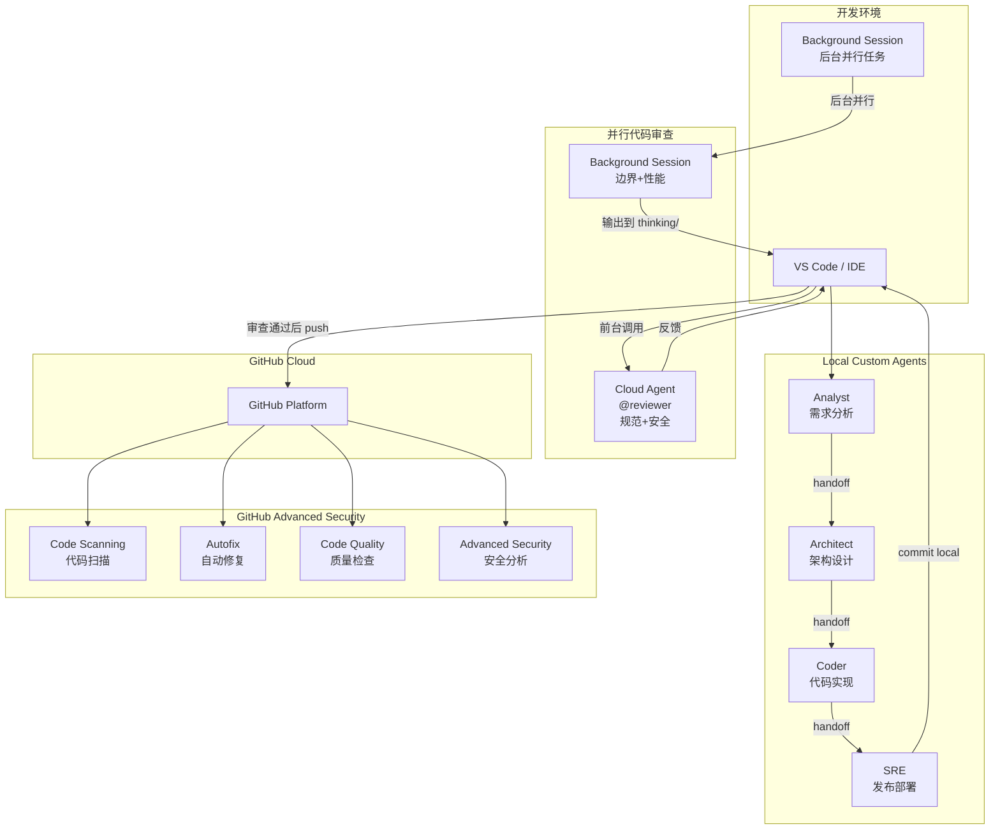
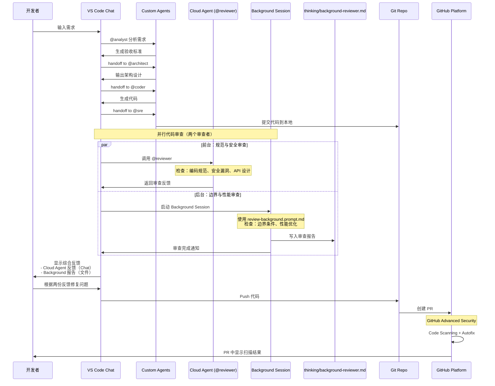
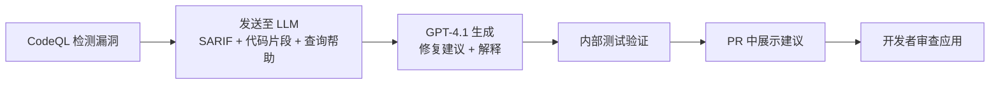
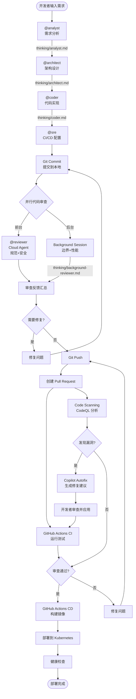

# GitHub Copilot Agents 完整开发工作流实战 Lab

## Lab 概述

本 Lab 将通过构建一个 **OKR 管理应用**，展示如何使用 GitHub Copilot 的三大 Agent 类型（Custom Agents、Cloud Agents、Copilot CLI）配合 GitHub Advanced Security 特性，实现从需求分析到代码审查、安全扫描的完整 AI 驱动开发流程。

**学习目标：**
- 理解 GitHub Copilot Agents 的三种类型及其适用场景
- 掌握 Custom Agents 在本地 IDE 中的协作开发流程
- 学习使用 Cloud Agents 进行代码审查
- 了解 Copilot CLI 在终端中的应用
- 实践 GitHub Advanced Security 功能（Code Scanning、Code Quality、Autofix）
- 构建完整的 AI 驱动 DevSecOps 工作流

---

## 第一部分：GitHub Copilot Agents 架构与类型

### 1.1 Agents 架构概览

GitHub Copilot Agents 是基于大语言模型的智能助手，能够理解上下文、执行任务并与开发者协作。根据部署位置和使用场景，分为三种类型：



---

### 1.2 Custom Agents（本地自定义 Agents）

**定义：** 存储在项目仓库 `.github/agents/` 目录下的 Markdown 文件，在本地 IDE 中运行。

**特点：**
- ✅ 完全可定制，适配团队特定工作流
- ✅ 离线可用（依赖本地模型）
- ✅ 支持 Agent 间协作（handoff 机制）
- ✅ 访问本地文件系统和工具链
- ✅ 保护敏感代码（不上传到云端）

**适用场景：**
- 团队特定的开发规范和流程
- 需要访问本地资源（数据库、配置文件）
- 敏感项目的代码生成
- 复杂的多步骤开发任务

**本 Lab 定义的 Custom Agents：**

| Agent | 职责 | 输入 | 输出 | Handoff |
|-------|------|------|------|---------|
| **Analyst** | 需求分析 | 用户故事 | 验收标准、接口初稿 | → Architect |
| **Architect** | 架构设计 | 需求分析 | 架构设计、技术选型、任务清单 | → Coder |
| **Coder** | 代码实现 | 架构设计 | 完整代码、测试、部署配置 | → SRE |
| **SRE** | 发布部署 | 实现代码 | CI/CD 配置、PR 创建 | - |

**配置位置：** `.github/agents/*.agent.md`

---

### 1.3 Cloud Agents（云端 Agents）

**定义：** 托管在 GitHub 组织级别 `.github-private` 仓库中的 Agents，通过 GitHub 云服务运行。

**特点：**
- ✅ 组织级共享，统一标准
- ✅ 无需本地配置，开箱即用
- ✅ 集成 GitHub 平台能力（API、Webhooks）
- ✅ 支持跨仓库协作
- ✅ 自动更新，版本集中管理

**适用场景：**
- 组织级代码审查标准
- 跨项目的安全检查
- 统一的合规性验证
- 自动化的协作流程

**本 Lab 定义的 Cloud Agent：**

| Agent | 职责 | 触发时机 | 功能 |
|-------|------|----------|------|
| **Reviewer** | 代码审查 | PR 创建时 | 代码质量检查、安全扫描、CodeQL 分析 |

**配置位置：** GitHub Org `/.github-private/agents/reviewer.agent.md`

---

### 1.4 Copilot CLI / Background Session（后台并行任务）

**定义：** GitHub Copilot 的终端形态 coding agent，类似 OpenAI Codex 或 Claude Code。在 VS Code 中称为 **Copilot Background Session**，能够在后台并行执行编程任务。

**特点：**
- ✅ 独立的 coding agent，不只是命令执行器
- ✅ **并行执行能力**：前台 Chat Agent 工作时，Background Session 可同时在后台处理任务
- ✅ 自然语言理解代码任务
- ✅ 实时上下文感知（当前目录、Git 状态、代码变更）
- ✅ 可以生成、分析、审查代码
- ✅ 结果可输出到文件（如 `thinking/` 目录）

**适用场景：**
- **并行代码审查**：前台 Cloud Agent 审查规范，后台审查性能和边界条件
- 后台运行测试套件和覆盖率分析
- 持续监控代码质量
- 并行开发不同模块
- 脚本生成与优化建议

**本 Lab 使用场景：**
在代码提交前的并行审查阶段：
- **前台（VS Code Chat）**: 调用 `@reviewer` Cloud Agent 进行规范和安全审查
- **后台（Background Session）**: 同时进行边界条件和性能优化审查，输出到 `thinking/background-reviewer.md`

**配置位置：** `.github/prompts/review-background.prompt.md`

---

### 1.5 三种 Agents 的协作模式



---

### 1.6 并行代码审查工作流详解

本 Lab 的核心创新是在 push 代码前引入**并行双审查机制**，利用 Cloud Agent 和 Background Session 的协作，实现更全面的代码质量保障。

#### 审查者分工

| 审查者 | 角色定位 | 审查重点 | 输出位置 | 触发方式 |
|--------|---------|---------|---------|---------|
| **Cloud Agent<br/>@reviewer** | 组织级规范守护者 | • 编码规范一致性<br/>• 安全漏洞检测<br/>• API 设计标准<br/>• 架构最佳实践 | VS Code Chat<br/>（实时反馈） | 前台调用 |
| **Background Session** | 代码健壮性专家 | • **边界条件检查**<br/>• **性能优化建议**<br/>• 潜在边缘案例<br/>• 算法复杂度分析 | `thinking/background-reviewer.md`<br/>（结构化报告） | 后台并行执行 |

#### 并行审查优势

1. **时间效率提升**
   - 串行审查：耗时 = 审查1 + 审查2
   - 并行审查：耗时 = max(审查1, 审查2)
   - 节省约 **40-50%** 的审查等待时间

2. **审查覆盖更全面**
   - Cloud Agent 专注"是否符合标准"
   - Background Session 专注"是否足够健壮"
   - 互补视角，降低遗漏风险

3. **反馈形式多样**
   - 实时交互反馈（Chat）+ 结构化文档（Markdown）
   - 适合不同场景的信息消费方式

#### Background Session 配置

**Prompt 文件**: `.github/prompts/review-background.prompt.md`

**输出报告**: `thinking/background-reviewer.md`

---

## 第二部分：GitHub Advanced Security 功能详解

### 2.1 GitHub Advanced Security 概述

GitHub Advanced Security (GHAS) 是 GitHub 的企业级安全解决方案，提供全面的代码安全和质量保障。

**核心组件：**

| 功能 | 描述 | 免费范围 |
|------|------|----------|
| **Code Scanning** | 静态代码分析，检测安全漏洞 | ✅ 公开仓库 |
| **Secret Scanning** | 扫描提交中的密钥和凭证 | ✅ 公开仓库 |
| **Dependency Review** | 依赖项漏洞检测 | ✅ 公开仓库 |
| **Copilot Autofix** | AI 驱动的漏洞自动修复 | ✅ 公开仓库<br/>✅ 企业私有仓库 |
| **Code Quality** | 代码质量问题检测与修复 | 🔒 GitHub Team/Enterprise Cloud<br/>（公开预览中） |

**许可要求：**
- 私有仓库：需要 GitHub Enterprise + GHAS 许可

---

### 2.2 Code Scanning（代码扫描）

**工作原理：**
Code Scanning 使用 CodeQL（GitHub 的语义代码分析引擎）扫描代码库，识别：
- 安全漏洞（CWE 分类）
- 代码质量问题
- 最佳实践偏差

**支持语言：**
- JavaScript/TypeScript
- Python
- Java/Kotlin
- C/C++/C#
- Go
- Ruby
- Rust
- Swift

**配置示例：**

```yaml
# .github/workflows/codeql-analysis.yml
name: "CodeQL"

on:
  push:
    branches: [ main ]
  pull_request:
    branches: [ main ]
  schedule:
    - cron: '0 0 * * 1'  # 每周一运行

jobs:
  analyze:
    name: Analyze
    runs-on: ubuntu-latest
    permissions:
      actions: read
      contents: read
      security-events: write

    strategy:
      matrix:
        language: [ 'javascript', 'typescript' ]

    steps:
    - name: Checkout repository
      uses: actions/checkout@v4

    - name: Initialize CodeQL
      uses: github/codeql-action/init@v3
      with:
        languages: ${{ matrix.language }}
        queries: security-extended  # 使用扩展安全查询

    - name: Autobuild
      uses: github/codeql-action/autobuild@v3

    - name: Perform CodeQL Analysis
      uses: github/codeql-action/analyze@v3
```

---

### 2.3 Copilot Autofix（自动修复）

**产品定位：**
Copilot Autofix 是 Code Scanning 的扩展功能，利用大语言模型（GPT-4.1）为安全告警生成针对性的修复建议，帮助开发者避免引入新的安全漏洞。

**可用性：**
- ✅ 所有 GitHub.com 公开仓库
- ✅ 启用 GitHub Code Security 的组织私有/内部仓库
- **无需** GitHub Copilot 订阅即可使用

**支持语言：**
C#、C/C++、Go、Java/Kotlin、Swift、JavaScript/TypeScript、Python、Ruby、Rust

**工作流程：**



**LLM 输入数据：**
- CodeQL 告警数据（SARIF 格式）
- 源码位置、接收位置周围的代码片段
- 相关文件的前 ~10 行
- CodeQL 查询的帮助文档

**质量保障：**
GitHub 使用自动化测试框架持续监控建议质量，包含 2,300+ 告警的测试集，验证：
1. 建议是否修复了告警？
2. 是否引入新的告警？
3. 是否引入语法错误？
4. 是否改变了测试输出？

**已知限制：**

| 限制类型 | 说明 |
|---------|------|
| **非确定性** | 相同告警可能生成不同建议，或无法生成建议 |
| **问题复杂度** | 跨文件的复杂数据流问题可能难以解决 |
| **文件大小** | 超大文件可能导致上下文被截断 |
| **语法错误** | 可能建议不正确的代码位置或语法 |
| **语义错误** | 可能改变程序行为，需要良好的测试覆盖 |
| **部分修复** | 可能仅部分解决漏洞或仅保留部分功能 |
| **依赖风险** | 可能建议添加不安全或不存在的依赖 |

**负责任的使用原则：**
1. **始终审查建议** - AI 建议可能不完美，需要开发者批判性评估
2. **验证修复有效性** - 确保告警被解决且未引入新问题
3. **运行完整测试** - CI 必须通过，验证功能行为不变
4. **检查依赖变更** - 审查任何依赖添加/更新的安全性
5. **理解修复原理** - 学习安全编码最佳实践

**数据隐私：**
- Autofix 处理的数据 **不会** 用于 LLM 训练
- 受 GitHub Advanced Security 现有条款约束

---

### 2.4 Code Quality（代码质量检查）

**产品定位：**
GitHub Code Quality 是独立于 Code Scanning 的代码质量分析工具，帮助团队识别代码质量风险、应用 Copilot 自动修复，并通过规则集强制执行质量标准。

**核心功能：**
- 在 **Pull Request** 和 **仓库扫描** 中标记代码质量问题
- 提供 **Copilot 自动修复** 建议（一键应用）
- 通过 **仓库仪表盘** 追踪可靠性和可维护性评分
- 使用 **Rulesets** 强制执行代码质量标准，阻止不合规的代码合并
- 支持将修复任务分配给 **Copilot coding agent**

**支持语言（基于 CodeQL 规则分析）：**
- C#、Go、Java、JavaScript、Python、Ruby、TypeScript

**AI 分析能力：**
- 除规则分析外，还提供 AI 驱动的分析结果（显示在 "AI findings" 仪表盘）
- AI 分析仅检查最近推送到默认分支的文件，可能识别更多语言的问题

**可用性要求：**
- 仅适用于组织拥有的仓库（GitHub Team 或 GitHub Enterprise Cloud）
- 公开预览期间不收费，但扫描会消耗 GitHub Actions 分钟数
- **无需** Copilot 或 Code Security 许可即可使用

**检测结果展示位置：**
- **Pull Request**: `github-code-quality[bot]` 会发表评论，包含问题说明和 Copilot Autofix 建议
- **仓库 Security 标签页**: "Standard findings"（CodeQL 分析）和 "AI findings"（AI 分析）

---

## 第三部分：实战项目 - OKR 管理应用

本部分的内容过程将会以 `https://github.com/nikadwangorg/agents-demo.git` 仓库做为记录。
- Initialize 一个新的 GitHub 仓库 `agents-demo`，
- 将 `.github/agents` 目录放到该仓库中，后续在 VS Code 中使用 GitHub Copilot Custom Agents 进行开发。
- 开启 GitHub Advanced Security 相关功能
   - Settings → Security → Advanced Security
   - 启用 "CodeQL analysis"
   - 启用 "Dependency graph"
   - 启用 "Dependabot alerts"
- 在 GitHub Org 中配置 .github-private  配置 `agents/reviewer.agent.md` 作为 Cloud Agent。


### 3.1 项目需求

**项目背景：**
构建一个轻量级的 OKR（Objectives and Key Results）管理系统，支持团队设定目标、追踪关键结果进度。

---

### 3.2 完整开发流程（使用 Custom Agents）

#### Step 1: 需求分析（@Analyst）

**在 VS Code 中操作：**

1. 打开 Copilot Chat, 切换至 Analyst Agent， 这还可以看到其它 Agents(Local Custom Agents 及 Cloud Agent)。


2. 输入：`我需要开发一个 OKR 管理应用，支持创建目标、添加关键结果、追踪进度。请进行需求分析。`

**Analyst 的输出（写入 `thinking/analyst.md`）：**


**点击架构设计，Analyst 会将任务 handoff 到 Architect**

---

#### Step 2: 架构设计（@Architect）

**Architect 自动接收任务并按照 architect.agent.md 里定义内容执行(包含切换 Model)， 最后输出到 `thinking/architect.md`：**


**再点击代码实现， Architect 会将任务自动 handoff 到 Coder**

---

#### Step 3: 代码实现（@Coder）

**Coder 执行所有任务，生成完整代码，并测试且修正直到能正常运行。在最后将它的工作记录归纳并输出到 `thinking/coder.md`：**


这个过程会有很多文件的生成及调试步骤，如果希望它能自动完成，需要打开 Auto Approve 让 Copilot 自主决定并持续工作。 

这里有两个细节:
1. 单独开了一个特性分支来完成这个场景的开发
2. 所有的测试用例都通过

**再点击 DevSecOps， Coder 会将任务自动 handoff 到 SRE**

----

#### Step 4: GitHub Workflow（@SRE）

**SRE 完善 DevSecOps 对应的 GitHub Workflow 文件，并创建 Pull Request，输出到 `thinking/sre.md`**


---
以上均为在  VS Code 中 GitHub Copilot Local Agent 的 Vibe Coding 场景


## 第四部分： 代码审查


本场景中使用不同 Agents 场景来做代码审查，包含 Cloud Agent， Background Copilot Session 及  GitHub PR 的 Copilot Code Review

---

在 VSCode Sidebar中打开 Agents 后可以看到创建不同的 Agent Session 模式:
- 当前 Local Agent 只能在前台独占任务执行（即同一时间只有一个 Local Agent 能执行任务），下面两种会话类别可以并行执行任务
- Cloud Agent 是前文中定义在 ORG 下的 .github-private/agents 下的 Agent
- Background Copilot Session 会在本地使用 Copilot CLI 来执行任务. 当前除 Workspace 目录空间外也支持 WorkTree 的外部目录模式。
  


### 4.1 Cloud Agent - Reviewer 审查

选择 Reviewer


可在 GitHub 中的 Copilot 的Agent 会话列表下能看到对应的工作任务，它通过新建分支 & PR 的方式来 Track 对应的工作任务,下面为 Review 结果

亦可以通过 GitHub Copilot 的 Agents 新建 Session 用于解决当前  GitHub Repo 中特定分支的问题， 它同样会新建分支与 PR 的形式来解决问题，即可以脱离 PC/IDE 来完成后续的工作任务。


### 4.2 Copilot Background Session - 选择特定的 代码审查 Prompt 


它会按照 Prompt 的要求，将 Review Comments 放入 `thinking/background-reviewer.md`。 将 VSCode 中调用  Coder 来按其审查意见提交至 Remote 仓库改代码，交给 Cloud Agent 进一步完善，本 Lab 不再展开

### 4.3 GitHub Copilot Code Review - 

在 feature 分支向 main 分支的 PR 中，可选择请 Copilot 审查代码


Copilot 会在当前 PR 中列出它对不同的文件修改意见，并能选择 Implment Sugesstion 让 Copilot 再开启 Cloud Agent 模式来修改，当然也可以通过 Resovle Conversation 来忽略它的意见


---

## 第五部分：GitHub Copilot on Security

### 5.1 启用 Code Quality
进入 GitHub Repo -> Settings ->  Security -> Code Quality ->  Enable 


它会被周期性或 `push 到 main 分支`的事件触发


### 5.2   AI Findings


---

## 第六部分：完整工作流演示

### 6.1 端到端流程图



---


## 第七部分：最佳实践与常见问题

### 7.1 Custom Agents 最佳实践

1. **清晰的职责分离**
   - 每个 Agent 专注单一领域
   - 避免职责重叠

2. **完善的 Handoff 机制**
   - 明确定义输入输出格式
   - 使用 `thinking/` 目录作为交接文档

3. **上下文管理**
   - 在 Agent 配置中引用项目文档
   - 提供必要的示例和约束

4. **迭代优化**
   - 根据实际使用效果调整 Agent prompt
   - 记录常见问题并更新指令

---

### 7.2 Cloud Agents 最佳实践

1. **组织级标准化**
   - 定义团队、部门级别通用的Agents 及 Instructions
   - 定期更新 Agent 配置

2. **权限管理**
   - 限制 `.github-private` 仓库访问权限
   - 审计 Agent 执行日志

---

## 第八部分：扩展学习资源

### 8.1 官方文档

- [GitHub Copilot Agents 文档](https://docs.github.com/en/copilot/using-github-copilot/using-github-copilot-agents)
- [GitHub Advanced Security 文档](https://docs.github.com/en/get-started/learning-about-github/about-github-advanced-security)
- [CodeQL 查询编写指南](https://codeql.github.com/docs/writing-codeql-queries/)
- [Copilot Autofix 负责任使用指南](https://docs.github.com/en/code-security/code-scanning/managing-code-scanning-alerts/responsible-use-autofix-code-scanning)


---

## 结语

通过本 Lab，你已经掌握了：

✅ GitHub Copilot 三种 Agent 类型的使用方法  
✅ Custom Agents 的协作开发流程  
✅ Cloud Agents 的代码审查能力  
✅ Copilot CLI 的命令行辅助  
✅ GitHub Advanced Security 的安全保障  
✅ 从需求到部署的完整 AI 驱动工作流  

**下一步建议：**
1. 在自己的项目中配置 Custom Agents
2. 为团队定制 Cloud Reviewer Agent
3. 启用 Code Scanning 和 Autofix
4. 探索更多 CodeQL 查询，识别项目特定的安全问题

**Happy Coding with GitHub Copilot! 🚀**
