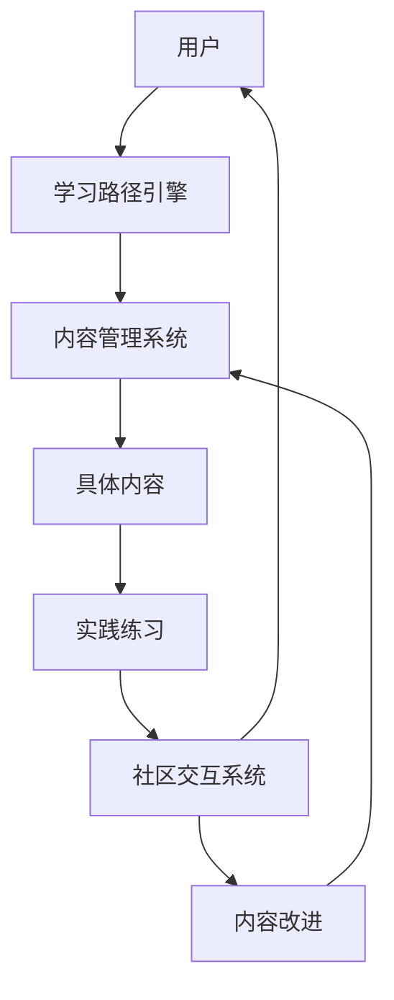
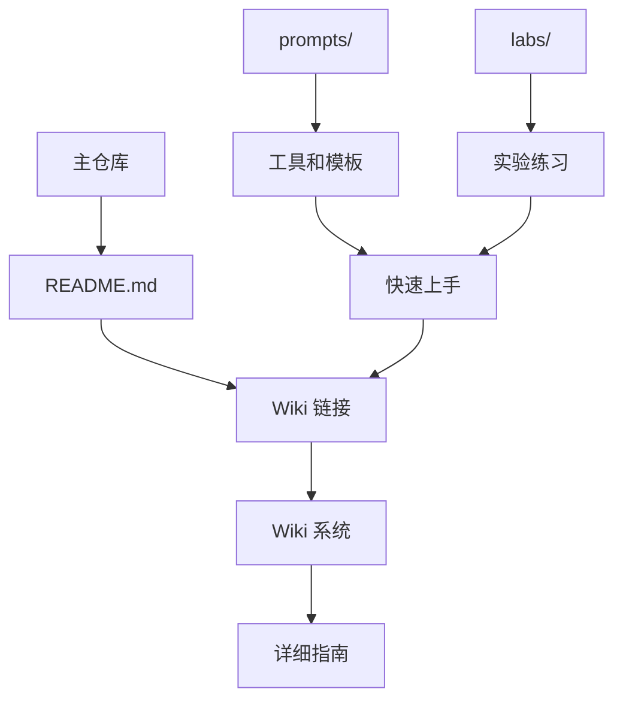

# 系统架构与设计模式

## 项目架构

### 仓库结构设计
```
sharing/
├── README.md                    # 项目主入口和概述
├── ai-instructions.md           # AI 助手指导文件
├── .github/
│   ├── copilot-instructions.md  # GitHub Copilot 特定指令
│   └── chatmodes/              # 聊天模式配置
├── memory-bank/                 # 项目记忆库
│   ├── projectbrief.md         # 项目概要
│   ├── productContext.md       # 产品背景
│   ├── systemPatterns.md       # 系统模式（本文件）
│   ├── techContext.md          # 技术上下文
│   ├── activeContext.md        # 当前活动上下文
│   ├── progress.md             # 项目进度
│   └── tasks/                  # 任务管理
├── library.wiki/               # Wiki 指南系统（独立Git仓库）
│   ├── Home.md                 # Wiki 首页
│   └── GitHub-Copilot-激活使用完全指南.md
├── labs/                       # 实验练习目录
└── prompts/                    # 提示词与工具生态
    ├── README.md              # 提示词与工具总览
    ├── code-generation/        # 代码生成模板
    ├── debugging/              # 调试模板
    ├── refactoring/            # 重构相关（计划中）
    ├── documentation/          # 文档生成（计划中）
    ├── testing/                # 测试相关（计划中）
    ├── mcp-tools/             # MCP工具集合
    └── extensions/            # 扩展工具推荐
```

### 信息架构原则
1. **层次化组织**：按功能和用途分层组织内容
2. **渐进式披露**：从概述到详细，逐层深入
3. **交叉引用**：相关内容之间建立链接
4. **模块化设计**：每个部分可独立使用也可组合使用
5. **实用性优先**：重视实际操作指导胜过理论介绍
6. **企业友好**：特别关注企业级部署和管理需求
7. **内容分离**：核心工具在主仓库，详细指南在 wiki
8. **维护便利**：wiki 独立维护，主仓库保持简洁

## 核心设计模式

### 1. 模板模式 (Template Pattern)
**应用场景**：标准化内容结构

**实现方式**：
- 每种内容类型都有固定的模板结构
- 指南：介绍 → 前置条件 → 步骤 → 示例 → 练习 → 总结
- 实验：目标 → 环境 → 任务 → 解决方案 → 反思
- 提示词：场景 → 模板 → 示例 → 输出 → 变体

**好处**：
- 确保内容质量和一致性
- 降低创作门槛
- 提升用户体验的可预期性

### 2. 策略模式 (Strategy Pattern)
**应用场景**：不同技能水平的学习路径

**实现方式**：
- 初学者策略：基础概念 + 简单示例 + 逐步指导
- 中级策略：最佳实践 + 复杂场景 + 优化技巧
- 高级策略：企业应用 + 自定义配置 + 性能优化

**好处**：
- 满足不同用户的需求
- 提供个性化的学习体验
- 支持技能提升的渐进路径

### 3. 观察者模式 (Observer Pattern)
**应用场景**：内容更新和版本管理

**实现方式**：
- 跟踪 GitHub Copilot 功能更新
- 监控社区反馈和需求变化
- 自动触发相关内容的更新检查

**好处**：
- 保持内容的时效性
- 快速响应功能变化
- 维护内容的准确性

### 4. 工厂模式 (Factory Pattern)
**应用场景**：内容生成和格式化

**实现方式**：
- 根据内容类型自动选择合适的模板
- 生成符合规范的文档结构
- 应用统一的格式和样式

**好处**：
- 简化内容创作流程
- 确保格式一致性
- 减少重复工作

## 组件关系设计

### 5. 适配器模式 (Adapter Pattern)
**应用场景**：整合不同类型的内容和工具

**实现方式**：
- 提示词模板适配器：统一不同场景的提示词格式
- MCP工具适配器：标准化工具集成接口
- 扩展工具适配器：统一扩展配置和使用方式

**好处**：
- 实现异构系统的无缝集成
- 提供统一的用户体验
- 降低学习和使用成本

### 6. 组合模式 (Composite Pattern)
**应用场景**：构建复合学习资源

**实现方式**：
- 提示词 + MCP工具 + 扩展的组合使用
- 指南 + 实验 + 模板的学习路径组合
- 基础配置 + 高级配置的渐进组合

**好处**：
- 支持灵活的资源组合
- 实现功能的叠加和增强
- 满足复杂场景的需求

## 新增架构特性

### 三大内容支柱设计
1. **提示词模板支柱**
   - 核心：经过验证的高效提示词
   - 特点：场景化、模板化、可复用
   - 价值：快速生成高质量代码

2. **MCP工具支柱**
   - 核心：Model Context Protocol 工具集成
   - 特点：扩展性、上下文感知、深度集成
   - 价值：增强Copilot的功能边界

3. **扩展工具支柱**
   - 核心：VS Code扩展和开发环境优化
   - 特点：生态完整、配置优化、工作流集成
   - 价值：提升整体开发体验

### 企业级架构考虑
1. **权限分层设计**
   - Free → Business → Enterprise 的功能递进
   - EMU 特殊场景的独立处理
   - 权限策略的集中管理

2. **部署复杂度管理**
   - 个人激活的简化流程
   - 组织部署的标准化指导
   - 企业级的定制化支持

3. **安全合规架构**
   - 网络配置的标准化
   - 代理和防火墙的配置指导
   - 数据安全和隐私保护

### 用户反馈驱动的架构演进
1. **简化优先原则**
   - 删除不常用的复杂功能说明
   - 突出核心使用场景
   - 减少认知负担

2. **实用性导向架构**
   - 操作步骤 > 理论介绍
   - 实际案例 > 抽象概念
   - 解决方案 > 问题分析

3. **迭代改进机制**
   - 用户反馈的快速集成
   - 内容的持续优化
   - 架构的灵活调整
1. **内容管理系统**
   - 模板管理
   - 版本控制
   - 质量检查

2. **学习路径引擎**
   - 技能评估
   - 路径推荐
   - 进度跟踪

3. **社区交互系统**
   - 反馈收集
   - 经验分享
   - 协作创作

### 组件交互模式


## 扩展性设计

### 水平扩展
- **内容类型扩展**：新增内容分类和模板
- **语言支持扩展**：支持更多编程语言示例
- **平台集成扩展**：与更多开发工具集成

### 垂直扩展
- **深度学习路径**：每个主题的深入探索
- **专业化方向**：特定领域的专门内容
- **企业级功能**：大型组织的特殊需求

### 社区扩展
- **贡献者体系**：建立内容贡献和审核机制
- **专家网络**：邀请专家提供高质量内容
- **本地化支持**：支持不同地区的特殊需求

## 质量保证架构

### 多层验证机制
1. **自动化检查**
   - 语法和格式验证
   - 链接有效性检查
   - 代码示例运行测试

2. **人工审核**
   - 内容准确性审核
   - 语言表达审核
   - 用户体验评估

3. **社区验证**
   - 用户反馈收集
   - 实际使用效果跟踪
   - 持续改进循环

### 版本管理策略
- **语义化版本**：主版本.次版本.修订版本
- **向后兼容**：保持学习路径的连续性
- **迁移指南**：帮助用户适应变化

## 技术债务管理

### 预防策略
- 建立清晰的代码和内容标准
- 定期进行技术回顾
- 及时重构过时的内容

### 监控指标
- 内容更新频率
- 用户反馈质量
- 维护工作量
- 新功能集成速度

### 7. 桥接模式 (Bridge Pattern)
**应用场景**：主仓库与 Wiki 系统的分离

**实现方式**：
- 主仓库专注于工具、模板和代码
- Wiki 系统专注于详细指南和文档
- README.md 作为桥接，提供指向 wiki 的链接
- 保持两个系统的独立性同时确保用户体验连贯

**好处**：
- 分离关注点，减少主仓库复杂性
- Wiki 支持更好的协作编辑
- 独立的版本控制和维护
- 提升内容管理效率

## Wiki 架构设计

### Wiki 结构原则
1. **独立性**：Wiki 作为独立的 Git 仓库管理
2. **专业性**：专注于详细指南和文档内容
3. **可维护性**：支持多人协作和版本控制
4. **可发现性**：通过主仓库 README 提供入口

### Wiki 内容分类
1. **配置指南**：技术配置和环境设置
2. **激活指南**：各版本的激活和部署流程
3. **故障排除**：常见问题和解决方案
4. **最佳实践**：场景化解决方案和使用技巧

### 主仓库与 Wiki 的协作模式


这种系统化的架构设计确保项目能够持续发展，同时保持高质量和用户友好性。

````
